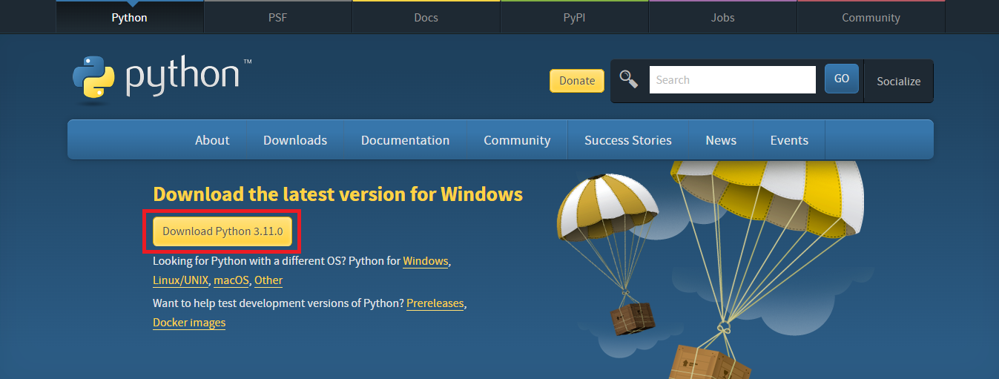

<html><head><meta http-equiv="Content-Type" content="text/html; charset=utf-8"/><title>Computer Vision Builder Series</title></head><body><article id="a19b4022-f0bf-47a3-b5bd-b66b51f9e8a4" class="page sans"><header><h1 class="page-title">Computer Vision Builder Series</h1></header>

<strong><strong><strong><strong><strong><strong><strong><strong><strong><strong><strong><strong><strong>Requirements: A Linux (Ubuntu) or Windows Machine with a webcam.</strong></strong></strong></strong></strong></strong></strong></strong></strong></strong></strong></strong></strong>

<figure id="f616e239-f9fb-4396-b83e-2abfc5814cbf" class="image"></figure><table id="0f77c792-9b1a-4496-9266-a2a031e6e623" class="simple-table"><tbody><tr id="8c6afe40-7429-4c1b-a84c-d4d78897513f"><td id="=SmH" class="" style="width:186px">Introduction to the course</td><td id="lMyn" class="" style="width:512px">This is an introductory course designed for people from any background and are completely new to the area of image processing.</td></tr><tr id="40f5ada8-f332-44d4-a9d0-7b8e3778d9ee"><td id="=SmH" class="" style="width:186px">What does this course aim to achieve?</td><td id="lMyn" class="" style="width:512px">It aims to give hands-on experience with various OpenCV tools and functionalities with many example problems and their solutions for students to work on and understand the usage of tools and functions in OpenCV.</td></tr><tr id="fb7b7b11-3e3b-4dca-8ac0-4b82701cc15b"><td id="=SmH" class="" style="width:186px">What is being built in this course?</td><td id="lMyn" class="" style="width:512px">At the end of the course, students will be equipped with all the necessary tools to perform the Build Tasks on their own. They will be building a program to detect and count pulse with a pre-recorded video; A program to cartoonize an image; And finally, a program that detects and tracks a ball bouncing on the ground with the bounce region and timestamp.</td></tr><tr id="c69d67c0-a3fb-4ec8-9929-c62acb6f13ac"><td id="=SmH" class="" style="width:186px">How is it being tested?</td><td id="lMyn" class="" style="width:512px"></td></tr><tr id="831f9e6a-5c4f-47af-86c3-e175dc0ce624"><td id="=SmH" class="" style="width:186px">Course Prerequisites</td><td id="lMyn" class="" style="width:512px">The course requires a student to know the basics of python, PIP (package manager for Python), basic shell commands in Linux, and version control with GIT.</td></tr></tbody></table>

<h1 id="6ca7ba6f-f161-47d0-b05c-ad0a7b04396c" class="">Contents</h1>
<strong>Pre-requisite.</strong>
<ol type="1" id="fd978aa2-01ac-467c-879a-c62b9ea7505f" class="numbered-list" start="1"><li>Shell</li></ol><ol type="1" id="d499da10-fa2d-447f-84ac-1f0c9639c572" class="numbered-list" start="2"><li>Python-Pip</li></ol><ol type="1" id="5083748b-a500-4209-a94c-fd4b3993428a" class="numbered-list" start="3"><li>Git</li></ol>

<strong>Core Computer Vision Learning Track:</strong>
<ol type="1" id="fbf54eb0-f3db-4b28-8a2e-2f26008eaf18" class="numbered-list" start="1"><li>Introduction</li></ol><ol type="1" id="6639422d-744d-486d-832e-19244d207524" class="numbered-list" start="2"><li>Reading - High-level overview of Video Encoding and ffmpeg
- Video Encoding - Compression and Resolutions

- Making Video Intuitive: An Explainer
</li></ol><ol type="1" id="35979ce2-2f55-453d-9628-447149c3780b" class="numbered-list" start="3"><li>Setting up Python, OpenCV, and Visual Studio Code
- Installing Python

- Windows

- Linux (Ubuntu)

- Installing OpenCV

- Installing and setting up Visual Studio Code

- Windows

- Linux (Ubuntu):

</li></ol>
4. Reading and saving image files using OpenCV

- Reading image files

- Changing colorspace

- Saving/writing image files

- Assignment_1

5. Reading and saving the video feed

- Launching the camera

- Getting video properties

- Changing video properties

- Accessing and manipulating pixels

- Saving the video

- Assignment_2

6. Drawing Functions

- Line, Arrowed Line, Polylines, Rectangle, Circle, Put Text

- Assignment_3

7. Interacting with the video

- Mouse Events

- Draw a rectangle with a mouse

- Draw a curve using a mouse

- Interacting with trackbars in OpenCV

- Assignment_4

8. Object detection and tracking with color mask.

- Understanding HSV colorspace

- Masking color

- Finding contours and bounding box

- Assignment_5 

9. Frame manipulation and transformation:

- Resize

- Rotate

- Edge detection

- Finding and drawing contours

- Smoothening

- Perspective warping

- Assignment_6

<strong>Capstone Build Tasks</strong>

I. Posterization (Cartoonization) of portraits

- Problem statement

- Guided steps

II. Pulse Count

- Problem statement

- Guided steps

III. Bounce Count

- Problem statement

- Guided steps

<strong>Uploading projects to GitHub</strong>

<h1 id="b23419f1-15b1-43d5-a6ec-06e3b7b8a865" class="">Pre-requisite:</h1>
<strong>The course requires a student to know the basics of python, PIP (package manager for Python), basic shell commands in Linux, and version control with GIT.</strong>
<ul id="688c726a-f39b-4289-ad2e-1ef4222f8d9e" class="bulleted-list"><li style="list-style-type:disc">You will be using Python programming language for this build task along with OpenCV-Python for manipulating and transforming images (frames) in a video.</li></ul><ul id="f3b222b2-7700-405d-b12f-c8007700577c" class="bulleted-list"><li style="list-style-type:disc">You will also use PIP which is a package manager for Python-based packages, that will be useful to install/uninstall and manages packages like OpenCV and NumPy, which you will be using throughout this build series.</li></ul><ul id="8a051546-f6c1-47cd-828c-e70b1dacff23" class="bulleted-list"><li style="list-style-type:disc">Finally, at the end of the series, you will finish capstone tasks on your own by following the instructions provided and uploading them to your personal GitHub profile to showcase your work to others. For which a basic knowledge of version control with GIT will be useful.</li></ul>
<strong><strong><strong><strong><strong>Hence it is assumed that the person following this builder series is familiar with the Pre-requisites. If not, the following resources might be useful to get started:</strong></strong></strong></strong></strong>
<ol type="1" id="625df354-e384-4148-b71e-fad86deb614d" class="numbered-list" start="1"><li><strong>SHELL:</strong><ul id="121686b7-09b5-4aff-9eb2-9665324b52c0" class="bulleted-list"><li style="list-style-type:disc">Install Linux Bash Shell on Windows 10: <a href="https://itsfoss.com/install-bash-on-windows/">https://itsfoss.com/install-bash-on-windows/</a></li></ul><ul id="5c587a64-5926-431c-b059-130a97747589" class="bulleted-list"><li style="list-style-type:disc">Course overview + the shell: <a href="https://missing.csail.mit.edu/2020/course-shell/">https://missing.csail.mit.edu/2020/course-shell/</a></li></ul><ul id="13b8f8b4-4b02-43ee-926b-58e470024722" class="bulleted-list"><li style="list-style-type:disc">TLCL Book-Chapter 1 (For further understanding): <a href="https://linuxcommand.org/tlcl.php">https://linuxcommand.org/tlcl.php</a></li></ul></li></ol><ol type="1" id="3e1739f3-876c-4ed1-829f-4aa5190be6b0" class="numbered-list" start="2"><li><strong>PYTHON-PIP:</strong><ul id="db627e3f-dd47-435e-b58c-14b322f80cc3" class="bulleted-list"><li style="list-style-type:disc">Python: <a href="https://github.com/iitmcvg/Python-Exercises">https://github.com/iitmcvg/Python-Exercises</a></li></ul><ul id="ccc7b45f-5792-4d18-bd22-51dcb751047d" class="bulleted-list"><li style="list-style-type:disc">Pip: <a href="https://www.w3schools.com/python/python_pip.asp">https://www.w3schools.com/python/python_pip.asp</a></li></ul><ul id="7b05929b-011f-4817-8b2f-0d3208bf28b4" class="bulleted-list"><li style="list-style-type:disc">NumPy (For further understanding): <a href="https://numpy.org/devdocs/user/absolute_beginners.html">https://numpy.org/devdocs/user/absolute_beginners.html</a></li></ul><ul id="715fd963-3fa5-4186-b90c-dc3d86a3af72" class="bulleted-list"><li style="list-style-type:disc">SciPy (For further understanding): <a href="https://www.mygreatlearning.com/blog/scipy-tutorial/">https://www.mygreatlearning.com/blog/scipy-tutorial/</a></li></ul><ul id="26d29e45-569d-4678-ad58-f1a6fc828ce8" class="bulleted-list"><li style="list-style-type:disc">SciPy API (For further understanding): <a href="https://docs.scipy.org/doc/scipy/reference/index.html">https://docs.scipy.org/doc/scipy/reference/index.html</a></li></ul></li></ol><ol type="1" id="cafa2d2a-e756-43d3-846a-828184ed9943" class="numbered-list" start="3"><li><strong>GIT:</strong><ul id="f878f56c-fd90-42cc-84c1-291b3fb95422" class="bulleted-list"><li style="list-style-type:disc">Quick Tutorial: <a href="https://www.w3schools.com/git/">https://www.w3schools.com/git/</a></li></ul><ul id="f3d39fb3-fdee-4077-9d43-464a7a770471" class="bulleted-list"><li style="list-style-type:disc">For a quick demo: <a href="https://www.youtube.com/watch?v=c6b6B9oN4Vg">https://www.youtube.com/watch?v=c6b6B9oN4Vg</a></li></ul><ul id="6e70b92f-38cb-41de-9e69-9fc6a4a85ca4" class="bulleted-list"><li style="list-style-type:disc">For interactive git learning (Optional): <a href="https://learngitbranching.js.org/">https://learngitbranching.js.org/</a></li></ul></li></ol>

<h1 id="50cf8422-fb07-43e6-b0ce-90afad78fb15" class=""><strong>Core Computer Vision Learning Track:</strong></h1><h2 id="f8e1ef93-58d5-420f-8e53-c605dd120dfe" class="">1. Introduction:</h2><ul id="9c8af812-27db-4173-b340-69b7dc266726" class="bulleted-list"><li style="list-style-type:disc">This is an introductory course is designed for people who are from any background and are completely new to the area of image processing.</li></ul><ul id="4198cae6-242a-4383-a9f4-fcd50f3bdd01" class="bulleted-list"><li style="list-style-type:disc">The Overall Course is divided into 3 parts.<ul id="e3b607ca-4f53-425b-a065-5d5f46f83cef" class="bulleted-list"><li style="list-style-type:circle">Core Computer Vision Learning Track</li></ul><ul id="4e4a138d-705f-4483-a6c1-15cd5a3404b4" class="bulleted-list"><li style="list-style-type:circle">Capstone Build Task</li></ul><ul id="a893a79f-6161-4db3-bb7f-055f03c45dff" class="bulleted-list"><li style="list-style-type:circle">Uploading Projects to GitHub</li></ul></li></ul><ul id="1db07924-fc21-422f-b9df-18f04b8653f8" class="bulleted-list"><li style="list-style-type:disc">Each section will walk you through some useful tools and functions and then example programs using those tools to achieve simple tasks. The Example codes are well commented to give you as much information as possible.</li></ul><ul id="6483b4e2-238d-4283-a689-8863a755f8a6" class="bulleted-list"><li style="list-style-type:disc">At the end of each section, there is an Assignment task for which the solution is not provided. These Assignments are designed in such a way that it tests your knowledge and understanding of the concepts until that point of the course.</li></ul><ul id="0794defd-af79-4dc3-9575-6a3aa7d22918" class="bulleted-list"><li style="list-style-type:disc">We will be using OpenCV, a popular and open-sourced image processing library along with python programming language. And for writing the code we will be using Visual Studio Code which is an IDE that contains everything in one place and also some helper plugins that will assist and make your coding work easy.</li></ul><ul id="d66338a4-1c0b-43e7-9994-e2ba59008f3d" class="bulleted-list"><li style="list-style-type:disc">At the end of the course, you will be equipped with all the necessary tools to perform the Build Tasks on your own. And finally, we will guide you to upload your projects and work repository to your personal GitHub account.</li></ul><ul id="6defa41d-0936-49eb-b023-73582034d1a7" class="bulleted-list"><li style="list-style-type:disc">Hope you enjoy this!</li></ul>

<h2 id="e36ca647-1a6d-48c8-9580-706fc4672513" class="">2. Reading - High-level overview of Video Encoding and ffmpeg:</h2>
<strong><strong><strong><strong><strong><strong><strong><strong><strong><strong><strong><strong><strong><strong><strong><strong><strong><strong><strong><strong><strong><strong><strong><strong><strong><strong><strong><strong><strong><strong><strong><strong><strong><strong><strong><strong><strong><strong><strong>Objective: In this, you will learn what is a video and a few important concepts around it such as resolution, compression, frame rate (FPS), Bitrate, etc.</strong></strong></strong></strong></strong></strong></strong></strong></strong></strong></strong></strong></strong></strong></strong></strong></strong></strong></strong></strong></strong></strong></strong></strong></strong></strong></strong></strong></strong></strong></strong></strong></strong></strong></strong></strong></strong></strong></strong>
<ul id="7e25eb54-e2a7-410f-95c0-cb448c8a6cc5" class="bulleted-list"><li style="list-style-type:disc"><strong><strong><strong>Video Encoding - Compression and Resolutions:</strong></strong></strong>
<a href="https://eyevinntechnology.medium.com/chessboard-for-beginners-video-encoding-compression-and-resolutions-bcefe04fa639">https://eyevinntechnology.medium.com/chessboard-for-beginners-video-encoding-compression-and-resolutions-bcefe04fa639</a>
</li></ul><ul id="1c5ab55b-2dfd-43a9-9b39-4643227cda8f" class="bulleted-list"><li style="list-style-type:disc"><strong><strong>Making Video Intuitive: An Explainer:</strong></strong>
<a href="https://blog.cloudflare.com/making-video-intuitive-an-explainer/">https://blog.cloudflare.com/making-video-intuitive-an-explainer/</a>
</li></ul>

<h2 id="df7f219a-6000-4ab1-8e12-eaf31af75073" class="">3. Setting up Python, OpenCV, and Visual Studio Code:</h2>
<strong><strong><strong><strong><strong><strong><strong><strong><strong><strong><strong><strong><strong><strong><strong><strong><strong><strong>Installing Python:</strong></strong></strong></strong></strong></strong></strong></strong></strong></strong></strong></strong></strong></strong></strong></strong></strong></strong>

<strong><strong><strong><strong>Windows:</strong></strong></strong></strong>
<ul id="046577a2-4e60-40d7-ba51-cf74ff0cdf76" class="bulleted-list"><li style="list-style-type:disc">Download and install Python from:<strong><strong><strong><strong> </strong></strong></strong></strong><a href="https://www.python.org/downloads/">https://www.python.org/downloads/</a></li></ul><figure id="f8337b85-343a-4a49-b631-7b802f2973da" class="image"></figure><figure id="a09bc318-5de0-41b0-b489-51f3d3de9083" class="image" style="text-align:center"></figure><figure id="38d849b6-355a-42fe-ad40-2dee893364a1" class="image" style="text-align:center"></figure>

<strong><strong><strong><strong><strong><strong><strong>Linux (Ubuntu): </strong></strong></strong></strong></strong></strong></strong>
<ul id="a9b42931-95ec-433e-a561-9ea2ce2cddfd" class="bulleted-list"><li style="list-style-type:disc">Linux distributions are likely to come with preinstalled Python. To check, open the terminal and run <code>python</code> or <code>python3</code> if it is installed already, you would see something similar to this:<pre id="bdd852ec-50ef-4c8c-9838-41e9a262226e" class="code"><code>user:~$ python3
Python 3.11.0a7 (main, Apr 20 2022, 17:44:14) 
[GCC 9.4.0] on linux
Type &quot;help&quot;, &quot;copyright&quot;, &quot;credits&quot; or &quot;license&quot; for more information.
&gt;&gt;&gt;</code></pre></li></ul><ul id="55ec518d-5974-451a-9fbd-15daefcc2c98" class="bulleted-list"><li style="list-style-type:disc"><strong>If not</strong>, follow the series of commands given below:<pre id="df84654a-cc70-40ab-841a-5d7ad68def01" class="code"><code>user:~$ sudo apt update
user:~$ sudo apt install python3</code></pre></li></ul>

<strong><strong><strong><strong><strong><strong><strong><strong>Installing OpenCV:</strong></strong></strong></strong></strong></strong></strong></strong>
<ul id="714aca8b-9c53-4d23-84fe-e99b80f4a3fb" class="bulleted-list"><li style="list-style-type:disc">Open Terminal or Command Prompt and run <code>pip install opencv-python</code> to install OpenCV Library.</li></ul><ul id="041c016e-b194-4324-987a-0696f9c56df3" class="bulleted-list"><li style="list-style-type:disc">For more details or troubleshooting refer: <a href="https://pypi.org/project/opencv-python/">https://pypi.org/project/opencv-python/</a></li></ul>

<strong><strong><strong><strong><strong><strong><strong><strong><strong><strong><strong><strong><strong><strong><strong><strong>Installing and setting up Visual Studio Code:</strong></strong></strong></strong></strong></strong></strong></strong></strong></strong></strong></strong></strong></strong></strong></strong>

<strong><strong><strong><strong><strong><strong><strong><strong><strong>Windows: </strong></strong></strong></strong></strong></strong></strong></strong></strong>
<ul id="43a0e7cb-29ec-4ea0-8cb5-a4be40659fa7" class="bulleted-list"><li style="list-style-type:disc">Download and install VS-Code from: <a href="https://code.visualstudio.com/download">https://code.visualstudio.com/download</a></li></ul><figure id="7ccc56ce-080a-4ebb-8fa9-3cd4b466754c" class="image" style="text-align:center"></figure><figure id="137c9727-9761-4e1b-a94d-9d3e19cf115c" class="image" style="text-align:center"></figure><figure id="c7200ff1-f6a6-49c8-908d-de5e2516cc99" class="image" style="text-align:center"></figure><figure id="6819f10e-113d-4d28-8ead-db53aa11e3ae" class="image" style="text-align:center"></figure><figure id="6f90be87-5bb3-4196-8584-407e2adf3083" class="image" style="text-align:center"></figure><figure id="a8bd77c7-fd43-426e-bb84-66133f465c46" class="image" style="text-align:center"></figure><ul id="77bfd4be-dc68-4a8b-a567-9c01d8211015" class="bulleted-list"><li style="list-style-type:disc"> After Installation, the welcome page similar to this opens up:</li></ul><figure id="31f057a5-5c09-4a3f-ab98-eea778ccbfbf" class="image"></figure><ul id="a1fec864-8a3e-4a6c-9988-3547e225a070" class="bulleted-list"><li style="list-style-type:disc">Open your project folder and create a new file as “test.py”. The extension “.py” after the filename is important as it helps in identifying the programming language used within the file.</li></ul><figure id="af6b0823-57b4-4be0-bfce-a2b0bb70ea79" class="image"></figure><figure id="da9884e1-3155-467e-b421-b6f87966c0f8" class="image"></figure><figure id="db8096df-1cba-473f-99ba-11d8177bccec" class="image"></figure><ul id="92e9e315-2a32-467f-8382-55c34a410bd3" class="bulleted-list"><li style="list-style-type:disc">After creating “<a href="http://test.py">test.py</a>”, type in <code>print(&quot;sample text&quot;)</code> in it and save using <code>ctrl+S</code>. And then click on the triangular button on the top right corner of the screen to run the “test.py” file</li></ul><figure id="47e3c7d0-c2e4-41f4-b1e1-5850f9195b63" class="image"></figure><ul id="632f31b1-52f3-4cab-90d8-4298b6fe40bd" class="bulleted-list"><li style="list-style-type:disc">Now install a few useful extensions like “Python”, “Pylance”, and “Jupyter” for VS Code. Click on the extensions tab &gt; search for the extensions in the search tab &gt; Open it and click on install.</li></ul><figure id="743966e8-1f44-41eb-a918-291e9ed7ed1c" class="image"></figure><figure id="325283db-2629-4e76-81af-a46f174efa41" class="image"></figure><ul id="ca9f35fc-33fb-45e3-b4b7-703d08072bf9" class="bulleted-list"><li style="list-style-type:disc">Now we are ready for the tasks.</li></ul>

<strong>Linux (Ubuntu):</strong>
<ul id="d9e39ab4-7043-491b-8bb9-0ccc237fc4dc" class="bulleted-list"><li style="list-style-type:disc">Open Ubuntu Software and search for Visual Studio Code, and install it from there.</li></ul><figure id="a9df4c22-25e3-41bf-8b34-4cf9285c6028" class="image"></figure><figure id="803c5f6f-81f1-42f8-9613-21459dfd5a8f" class="image"></figure><ul id="148acd90-a5bb-412d-bea3-513996e29e80" class="bulleted-list"><li style="list-style-type:disc">After installation, the remaining instructions are the same as instructions for Windows.</li></ul>

<h2 id="c554fe95-9e99-48df-9933-96cb696f93e2" class="">4. Reading and saving image files using OpenCV:</h2>
<strong>Objective: In this section, you will learn how to read an image and save it after converting it to Grayscale. Check out the example code below.</strong>

<strong><strong><strong><strong><strong><strong><strong><strong><strong><strong><strong><strong><strong><strong><strong><strong><strong><strong><strong>READING IMAGE FILES</strong></strong></strong></strong></strong></strong></strong></strong></strong></strong></strong></strong></strong></strong></strong></strong></strong></strong></strong>
<ul id="1a326916-85b0-4a47-a731-dc5abb993811" class="bulleted-list"><li style="list-style-type:disc">Before starting create a folder on the desktop named “CV_Builder_Series”, and another folder named “task_1” in it.</li></ul><ul id="09cb51f7-cd42-4042-ba45-ff8ccc4a2bd2" class="bulleted-list"><li style="list-style-type:disc">Open VS Code &gt; press <code>Ctrl + K + O</code> to open a project folder &gt; Navigate to the desktop and open “CV_Builder_Series”.</li></ul><ul id="96e40ecf-952a-47a5-9571-618b6b1edf30" class="bulleted-list"><li style="list-style-type:disc">Create a new file named <code>task_1.py</code> inside the folder “task_1”.</li></ul><ul id="480c08b2-62a6-4757-ae58-e1cfab293343" class="bulleted-list"><li style="list-style-type:disc">First import <code>cv2</code> library, and then you will use <code>imread</code> function to read an input image, <code>imshow</code> function to display the image on a window, <code>waitKey</code> function to hold the program until there’s any key press, and finally <code>destroyAllWindows</code> to kill all the active windows at the end of the program.
<strong>syntax: </strong>

<code>cv2.imread(path, flag)</code> 

for more details on <code>flag</code>, refer: <a href="https://docs.opencv.org/3.4/d8/d6a/group__imgcodecs__flags.html#gga61d9b0126a3e57d9277ac48327799c80af660544735200cbe942eea09232eb822">Flags used for image file reading and writing</a>

<code>cv2.imshow(window_name, image_name)</code>

<strong><strong><strong><strong><strong><strong><strong><strong>example code:</strong></strong></strong></strong></strong></strong></strong></strong>
<pre id="ba867dd2-a860-4af1-9621-d94163d3a033" class="code"><code># Importing OpenCV Library
import cv2

# Relative or absolute path of the input image file
path = &quot;./task_1/tom.jpg&quot;

# reading image (by default the flag is 1 if not specidied)
image = cv2.imread(path)

# Display image in a window
cv2.imshow(&quot;Output&quot;,image)

# Wait until any key press (press any key to close the window)
cv2.waitKey()
# kill all the windows
cv2.destroyAllWindows()</code></pre>
<strong><strong><strong><strong><strong><strong><strong><strong><strong><strong><strong><strong><strong><strong><strong><strong>Expected Output:</strong></strong></strong></strong></strong></strong></strong></strong></strong></strong></strong></strong></strong></strong></strong></strong>
<figure id="754f7ba7-eeec-464f-a05c-25360f1103da" class="image"></figure></li></ul>
<strong><strong><strong><strong><strong><strong><strong><strong><strong><strong><strong><strong><strong><strong><strong><strong><strong><strong><strong><strong>CHANGING COLORSPACE</strong></strong></strong></strong></strong></strong></strong></strong></strong></strong></strong></strong></strong></strong></strong></strong></strong></strong></strong></strong>
<ul id="0d43ba80-20f6-4318-814a-198b1b1565e5" class="bulleted-list"><li style="list-style-type:disc">Now try using <code>cvtColor</code> to convert the image to Grayscale using <code>COLOR_BGR2GRAY</code> option in the previous code and display both images using <code>imshow</code>
<strong><strong><strong><strong><strong><strong>syntax:</strong></strong></strong></strong></strong></strong>

<code>cv2.cvtColor(source_image,color_conversion_code)</code>

for more information on <code>color_conversion_code</code>, refer: <a href="https://docs.opencv.org/3.4/d8/d01/group__imgproc__color__conversions.html">Color Space Conversions</a>

<strong><strong><strong><strong><strong><strong><strong><strong>example:</strong></strong></strong></strong></strong></strong></strong></strong>
<pre id="fe639b42-e9cd-4ce9-accd-8c573671ab23" class="code"><code># Importing OpenCV Library
import cv2

# Relative or absolute path of the input image file
path = &quot;./task_1/tom.jpg&quot;

# reading image (by default the flag is 1 if not specidied)
image = cv2.imread(path)

# converting image to Grayscale (also OpenCV reads image in BGR format and hence BGR to Gray)
image_gray = cv2.cvtColor(image,cv2.COLOR_BGR2GRAY)

# Display image in a window
cv2.imshow(&quot;Output&quot;,image)
cv2.imshow(&quot;Output_gray&quot;,image_gray)

# Wait until any key press (press any key to close the window)
cv2.waitKey()
# kill all the windows
cv2.destroyAllWindows()</code></pre>
<strong><strong><strong><strong><strong><strong><strong><strong><strong><strong><strong><strong><strong><strong><strong><strong>Expected Output:</strong></strong></strong></strong></strong></strong></strong></strong></strong></strong></strong></strong></strong></strong></strong></strong>
<figure id="bfdfb0e1-25b2-41f8-a10d-6e158ad1d0d6" class="image"></figure></li></ul>
<strong><strong><strong><strong><strong><strong><strong><strong><strong><strong><strong><strong><strong><strong><strong><strong><strong><strong><strong><strong><strong><strong><strong><strong>SAVING/WRITING IMAGE FILE</strong></strong></strong></strong></strong></strong></strong></strong></strong></strong></strong></strong></strong></strong></strong></strong></strong></strong></strong></strong></strong></strong></strong></strong>
<ul id="13168ff7-b80d-403c-97cb-60e31e4cc51d" class="bulleted-list"><li style="list-style-type:disc">Lets save the gray image using <code>imwrite</code> function.
<strong><strong><strong><strong><strong><strong><strong><strong><strong>syntax: </strong></strong></strong></strong></strong></strong></strong></strong></strong>

<code>cv2.imwrite(path + file_name, image_name)</code>

<strong>example: </strong><code><strong>task_1.py</strong></code>
<pre id="edfd493b-2a9e-4e0a-8d12-690aa3476820" class="code"><code># Importing OpenCV Library
import cv2

# Relative or absolute path of the input image file
path = &quot;./task_1/tom.jpg&quot;

# reading image (by default the flag is 1 if not specidied)
image = cv2.imread(path)

# converting image to Grayscale (also OpenCV reads image in BGR format and hence BGR to Gray)
image_gray = cv2.cvtColor(image,cv2.COLOR_BGR2GRAY)

# Display image in a window
cv2.imshow(&quot;Output&quot;,image)
cv2.imshow(&quot;Output_gray&quot;,image_gray)

# Saving the image
cv2.imwrite(&#x27;./task_1/tom_gray.jpg&#x27;,image_gray)

# Wait until any key press (press any key to close the window)
cv2.waitKey()
# kill all the windows
cv2.destroyAllWindows()</code></pre>
<strong>expected output:</strong>
<figure id="795bf205-3779-4cd0-8cf9-8f010b28353d" class="image"></figure></li></ul>
<strong><strong><strong>ASSIGNMENT_1:</strong></strong></strong><strong><strong><strong> </strong></strong></strong>
<ul id="93b8db5c-8d9c-42df-bdaa-576dfc09f2f9" class="bulleted-list"><li style="list-style-type:disc">Read 2 different images.</li></ul><ul id="72377926-a2fb-4aa1-aab3-222ddaab5be4" class="bulleted-list"><li style="list-style-type:disc">Create a new image by arranging them side-by-side.</li></ul><ul id="b72d2574-b856-47da-ac23-ec1ff7877494" class="bulleted-list"><li style="list-style-type:disc">Convert that new image to Gray.</li></ul><ul id="de436db6-22bb-4fbb-b6cb-5630661d6520" class="bulleted-list"><li style="list-style-type:disc">Finally, arrange the colored pair of images on top and the pair of gray images on the bottom and save it as “A1_solution.jpg”</li></ul>
<strong>Tip</strong>: Remember to match the shape of the Grayscale image to that of the colored image while concatenating.

<strong><strong><strong><strong><strong>Expected Output:</strong></strong></strong></strong></strong>
<figure id="28026cd2-7a49-4808-8698-03eee4273481" class="image"></figure>

<h2 id="c9d9ce57-7637-41aa-8b54-6249ecb53e44" class="">5. Reading and saving the video feed:</h2>
<strong>Objective: In this section, you will learn how to get a video feed from a camera as well as from a video file, some useful functions to get and also set the video properties, and access and manipulate the pixel values. </strong>

<strong><strong><strong><strong><strong><strong><strong><strong><strong><strong>LAUNCHING THE CAMERA</strong></strong></strong></strong></strong></strong></strong></strong></strong></strong>
<ul id="6e34fc23-eb2f-4066-ba9e-c401774fb47f" class="bulleted-list"><li style="list-style-type:disc">For this task, you will be using the function <code>VideoCapture</code> to create a video capture object that connects the camera. It can either take in a camera as a parameter (an integer) or a video file path, or any IP camera.</li></ul><ul id="4e2f4bd1-f3de-4c33-be1f-a18a0d3cd34c" class="bulleted-list"><li style="list-style-type:disc">Another function <code>read</code> is used to read frames one by one from the video capture object on which we can perform image processing. A function <code>imshow</code> is used to display the frame in a window.</li></ul><ul id="085d4184-d8a7-4af8-a663-f205714a73c8" class="bulleted-list"><li style="list-style-type:disc">We also need something to break out of the loop where the <code>waitKey</code> function comes in handy. It takes in time in milliseconds as a parameter and waits for the given time before closing the window. This function also returns the ASCII value of the key pressed on the keyboard, which can be used to detect a particular key press to trigger some action.</li></ul><ul id="0085bd59-e2d3-4743-aa53-a526a114fe65" class="bulleted-list"><li style="list-style-type:disc">Finally, <code>cv2.destroyAllWindows()</code> is used to close all active OpenCV windows.</li></ul>
<strong><strong><strong><strong><strong><strong><strong><strong>Syntax: </strong></strong></strong></strong></strong></strong></strong></strong>

<code>cam =cv2.VideoCapture(input)</code>

Input can be a camera number or a video file or an IP camera.

<code>cam.read()</code> 

This function returns two arguments: True or False which indicates a successful frame read, and a numpy array of the current frame.

<code>cv2.imshow(’window_name’, frame_name)</code>

<code>window_name</code> &gt; Name of the window in which you want to display the current frame.

<code>frame_name</code> &gt; Frame that you want to display in the current loop.

<ul id="37da01c5-0608-4aff-bd0e-40072d258f32" class="bulleted-list"><li style="list-style-type:disc">Checkout the following example code that reads the camera and displays the feed in a window:</li></ul>
<strong><strong><strong><strong><strong><strong><strong><strong><strong><strong><strong><strong><strong>Example Code:</strong></strong></strong></strong></strong></strong></strong></strong></strong></strong></strong></strong></strong>
<pre id="d4f9174a-4269-44a3-acd9-2a32de252532" class="code"><code># import required libraries here
import cv2

# video capture object where 0 is the camera number for a usb camera (or webcam)
# if 0 doesn&#x27;t work, you might need to change the camera number to get the right camera you want to access
cam = cv2.VideoCapture(0)

# # for video file, use:
# cam = cv2.VideoCapture(&#x27;video_file_path&#x27;)

# # for IP camera, use:
# cam = cv2.VideoCapture(&#x27;IP_Address&#x27;)

while True:
    _ , frame = cam.read() # reading one frame from the camera object
    cv2.imshow(&#x27;Webcam&#x27;, frame) # display the current frame in a window named &#x27;Webcam&#x27;

    # Waits for 1ms and check for the pressed key
    if cv2.waitKey(1) &amp; 0xff == ord(&#x27;q&#x27;): # press q to quit the camera (get out of loop)
        break
cam.release() # close the camera
cv2.destroyAllWindows() # Close all the active windows</code></pre>
<strong><strong><strong><strong><strong><strong><strong><strong><strong><strong><strong><strong><strong><strong><strong><strong>Expected Output:</strong></strong></strong></strong></strong></strong></strong></strong></strong></strong></strong></strong></strong></strong></strong></strong>
<figure id="223f48bc-0d9c-414c-8bd5-726c23efdf59" class="image" style="text-align:center"></figure>
<strong>GETTING VIDEO PROPERTIES:</strong>
<ul id="ec68bffc-1ab5-4151-b2be-77aed5aab46d" class="bulleted-list"><li style="list-style-type:disc">There are a few useful functions in OpenCV to get information about the input video feed such as width, height, and fps.</li></ul><ul id="05cbd2d3-6c38-4725-b76f-0cfac8f3c823" class="bulleted-list"><li style="list-style-type:disc">Try using the <code>cv2.CAP_PROP_FRAME_WIDTH</code>, <code>cv2.CAP_PROP_FRAME_HEIGHT</code>, and <code>cv2.CAP_PROP_FPS</code> to get the width, height, and fps respectively. Here is a list of other properties that you can access: <a href="https://docs.opencv.org/3.4/d4/d15/group__videoio__flags__base.html#gaeb8dd9c89c10a5c63c139bf7c4f5704d"><strong>VideoCaptureProperties</strong></a><strong>.</strong></li></ul>
<strong><strong><strong><strong><strong><strong><strong>Syntax:</strong></strong></strong></strong></strong></strong></strong>

<code>cam.get(video_capture_property)</code>

<code>video_capture_property</code> &gt; this can be any property that you want to access from the list of properties given here: <a href="https://docs.opencv.org/3.4/d4/d15/group__videoio__flags__base.html#gaeb8dd9c89c10a5c63c139bf7c4f5704d"><strong>VideoCaptureProperties</strong></a><strong>.</strong>

<ul id="4858a94e-bc44-4eff-92a7-103ade0a8907" class="bulleted-list"><li style="list-style-type:disc">Below is an example code that prints out the width, height, and frames per second of the camera feed.</li></ul>
<strong><strong><strong><strong><strong><strong><strong>Example Code:</strong></strong></strong></strong></strong></strong></strong>
<pre id="b2479b57-1903-4eaf-8dea-c1b0c532a1bd" class="code"><code># import required libraries here
import cv2

# video capture object where 0 is the camera number for a usb camera (or webcam)
# if 0 doesn&#x27;t work, you might need to change the camera number to get the right camera you want to access
cam = cv2.VideoCapture(0)

# Getting camera feed width and height
width = cam.get(cv2.CAP_PROP_FRAME_WIDTH)
height = cam.get(cv2.CAP_PROP_FRAME_HEIGHT)
fps = cam.get(cv2.CAP_PROP_FPS)

# # for video file, use:
# cam = cv2.VideoCapture(&#x27;video_file_path&#x27;)

# # for IP camera, use:
# cam = cv2.VideoCapture(&#x27;IP_Address&#x27;)

while True:
    i, frame = cam.read() # reading one frame from the camera object
    cv2.imshow(&#x27;Webcam&#x27;, frame) # display the current frame in a window named &#x27;Webcam&#x27;
    print(&#x27;resolution:&#x27;,width, &#x27;x&#x27;, height, &#x27;| frames per second:&#x27;, fps)
    # Waits for 1ms and check for the pressed key
    if cv2.waitKey(1) &amp; 0xff == ord(&#x27;q&#x27;): # press q to quit the camera (get out of loop)
        break
cam.release() # close the camera
cv2.destroyAllWindows() # Close all the active windows</code></pre>
<strong><strong><strong><strong><strong><strong><strong><strong><strong><strong><strong><strong><strong><strong><strong><strong>Expected Output:</strong></strong></strong></strong></strong></strong></strong></strong></strong></strong></strong></strong></strong></strong></strong></strong>
<pre id="8f85bd68-cae4-4309-ac0c-afc61ffaedd8" class="code"><code>resolution: 640.0 x 480.0 | frames per second: 30.0
resolution: 640.0 x 480.0 | frames per second: 30.0
resolution: 640.0 x 480.0 | frames per second: 30.0
resolution: 640.0 x 480.0 | frames per second: 30.0</code></pre>
<strong>CHANGING VIDEO PROPERTIES:</strong>
<ul id="bff0b61d-9725-4075-90ee-00d7c39cc474" class="bulleted-list"><li style="list-style-type:disc">You can also set the video properties using <code>set</code> function which is similar to the <code>get</code> function in the above example.</li></ul><ul id="bbdcc27d-776a-4514-8d4a-ea139f482349" class="bulleted-list"><li style="list-style-type:disc">It takes in two arguments; the property and the value for it.</li></ul>
<strong><strong><strong><strong><strong><strong><strong>Syntax:</strong></strong></strong></strong></strong></strong></strong>

<code>cam.set(video_capture_property, value)</code>

<code>video_capture_property</code> &gt; this can be any property that you want to set from the list of properties given here: <a href="https://docs.opencv.org/3.4/d4/d15/group__videoio__flags__base.html#gaeb8dd9c89c10a5c63c139bf7c4f5704d"><strong>VideoCaptureProperties</strong></a><strong>.</strong>

<code>value</code> &gt; the value that you want that property to have

<ul id="e4c7db7c-a2ce-40b0-b951-87b4bc5273da" class="bulleted-list"><li style="list-style-type:disc">Let&#x27;s edit the previous example code in which, we set the width, height, and fps to a different value and the use <code>get</code> function, and print those values to check if it’s been modified or not.</li></ul>
<strong><strong><strong><strong><strong><strong><strong><strong><strong><strong><strong><strong><strong>Example Code:</strong></strong></strong></strong></strong></strong></strong></strong></strong></strong></strong></strong></strong>
<pre id="f5026ec6-9877-4bcf-af35-3c2a02f32e5b" class="code"><code># import required libraries here
import cv2

# video capture object where 0 is the camera number for a usb camera (or webcam)
# if 0 doesn&#x27;t work, you might need to change the camera number to get the right camera you want to access
cam = cv2.VideoCapture(0)

# Changing video capture property 
cam.set(cv2.CAP_PROP_FRAME_WIDTH,1280)
cam.set(cv2.CAP_PROP_FRAME_HEIGHT,720)
cam.set(cv2.CAP_PROP_FPS,15)

# Getting camera feed width and height after modifying them
width = cam.get(cv2.CAP_PROP_FRAME_WIDTH)
height = cam.get(cv2.CAP_PROP_FRAME_HEIGHT)
fps = cam.get(cv2.CAP_PROP_FPS)

# # for video file, use:
# cam = cv2.VideoCapture(&#x27;video_file_path&#x27;)

# # for IP camera, use:
# cam = cv2.VideoCapture(&#x27;IP_Address&#x27;)

while True:
    i, frame = cam.read() # reading one frame from the camera object
    cv2.imshow(&#x27;Webcam&#x27;, frame) # display the current frame in a window named &#x27;Webcam&#x27;
    print(&#x27;resolution:&#x27;,width, &#x27;x&#x27;, height, &#x27;| frames per second:&#x27;, fps)
    # Waits for 1ms and check for the pressed key
    if cv2.waitKey(1) &amp; 0xff == ord(&#x27;q&#x27;): # press q to quit the camera (get out of the loop)
        break
cam.release() # close the camera
cv2.destroyAllWindows() # Close all the active windows</code></pre>
<strong><strong><strong><strong><strong><strong><strong><strong><strong><strong><strong><strong><strong><strong><strong><strong>Expected Output:</strong></strong></strong></strong></strong></strong></strong></strong></strong></strong></strong></strong></strong></strong></strong></strong>
<pre id="ecde7eba-021a-4931-b69c-29a175e77f10" class="code"><code>resolution: 1280.0 x 720.0 | frames per second: 30.0
resolution: 1280.0 x 720.0 | frames per second: 30.0
resolution: 1280.0 x 720.0 | frames per second: 30.0
resolution: 1280.0 x 720.0 | frames per second: 30.0</code></pre><ul id="9d076ad5-eea8-4d40-8750-6919aa9d5c0e" class="bulleted-list"><li style="list-style-type:disc">Notice how the resolution changed but the fps didn’t. This is because it will only accept the properties supported by your camera.</li></ul><ul id="f1d6ed95-f43a-4560-9303-bd2b75bd9fea" class="bulleted-list"><li style="list-style-type:disc">You can try other resolutions, if the camera supports the resolution, it will work, otherwise, it won&#x27;t.</li></ul>
<strong><strong><strong><strong><strong><strong><strong><strong><strong><strong><strong><strong><strong><strong><strong><strong><strong><strong><strong><strong>ACCESSING AND MANIPULATING PIXELS:</strong></strong></strong></strong></strong></strong></strong></strong></strong></strong></strong></strong></strong></strong></strong></strong></strong></strong></strong></strong>
<ul id="cd8abf2d-c247-48ed-87d1-4c5b214d7fed" class="bulleted-list"><li style="list-style-type:disc">Here you will learn how to experiment with pixels by accessing and changing their values.</li></ul><ul id="7372209e-bd8b-465b-8cff-e53d0695f09e" class="bulleted-list"><li style="list-style-type:disc">Use the first example code from task_1 to read an image. OpenCV reads images in numpy array format.</li></ul><ul id="844c084b-8e96-4d1e-a78c-a30b0abf2ca3" class="bulleted-list"><li style="list-style-type:disc">In the code after reading the image print <code>image.shape</code> to check the <strong>dimension </strong>of the image. You could see something similar to the following:
<code>print(&#x27;image array dimension: &#x27;, image.shape)</code>

<strong><strong><strong><strong><strong><strong><strong><strong><strong>Output: </strong></strong></strong></strong></strong></strong></strong></strong></strong><code>image array dimension: (451, 445, 3)</code> &gt; which means the image has 451 pixels widthwise, 445 pixels heightwise, and 3 channels (RGB).
</li></ul><ul id="422304e3-3d45-4667-9af3-c2e86130e65f" class="bulleted-list"><li style="list-style-type:disc">Now try accessing one of the pixels at the 5th row and 5th column position by <code>image[5,5]</code>.
<code>print(&#x27;a pixel: &#x27;, image[5,5])</code>

<strong>Output: </strong><code>a pixel: [164 195 218]</code> &gt; here Blue, Green, and Red values are 164, 195, and 218 respectively for this “5th, 5th” pixel.
</li></ul><ul id="80a8c678-399f-42f2-9d85-3073aa52b9ff" class="bulleted-list"><li style="list-style-type:disc">Now let’s take a small region from the image; <code>new_image = image[:10,:10]</code> (top left corner with 10x10 pixels) and try to split the channels with; <code>B = new_image[:,:,0]</code> , <code>G = new_image[:,:,1]</code> and <code>R = new_image[:,:,2]</code> </li></ul><ul id="fb38014e-db8b-43c9-b0fd-92f47e5893bf" class="bulleted-list"><li style="list-style-type:disc">Add this code snippet to achieve the above task:</li></ul>
<strong><strong><strong><strong>Example Code Snippet:</strong></strong></strong></strong>
<pre id="45c4d2ad-dd62-43ed-ac7b-c0478caf0dcb" class="code"><code>new_image = image[:10,:10]
B = new_image[:,:,0]
G = new_image[:,:,1]
R = new_image[:,:,2]

print(&#x27;Blue Channel&#x27;)
print(B)
print(&#x27;Green Channel&#x27;)
print(G)
print(&#x27;Red Channel&#x27;)
print(R)</code></pre>
<strong>Expected Output:</strong>
<pre id="8e45d3ea-1df1-4c2d-9207-91221de71bdd" class="code"><code>Blue Channel
[[168 167 164 162 161 158 155 152 150 147]
 [167 167 164 163 162 159 156 155 152 149]
 [168 168 165 164 163 160 157 156 153 150]
 [170 169 168 165 164 162 159 156 153 152]
 [173 170 168 165 164 162 159 156 154 153]
 [172 171 168 167 164 164 162 160 158 155]
 [174 172 171 168 165 165 163 161 158 155]
 [175 174 172 171 168 165 164 162 159 156]
 [173 173 172 172 169 166 165 163 160 158]
 [173 173 172 172 169 168 165 164 161 159]]
Green Channel
[[198 197 195 194 191 191 189 188 185 185]
 [197 197 195 194 193 192 190 189 187 187]
 [198 198 196 195 194 193 191 190 189 188]
 [200 199 197 196 195 193 192 190 189 188]
 [201 200 198 196 195 193 192 191 191 189]
 [200 199 198 197 195 195 193 193 193 192]
 [203 201 199 198 196 196 195 195 194 192]
 [204 203 201 199 198 196 195 194 193 192]
 [202 202 201 200 199 198 196 196 194 194]
 [202 202 201 201 199 198 196 197 193 193]]
Red Channel
[[217 216 218 217 218 217 219 218 218 217]
 [216 216 216 217 218 218 219 219 220 219]
 [217 217 217 218 219 219 220 219 219 220]
 [219 218 218 217 218 218 218 219 219 218]
 [218 217 217 217 218 218 218 217 219 219]
 [217 216 215 216 216 218 218 219 219 220]
 [218 216 216 217 217 219 218 219 218 218]
 [218 217 216 216 217 217 218 217 217 216]
 [216 216 216 217 218 217 217 216 217 218]
 [216 216 216 216 218 217 217 217 216 216]]</code></pre><ul id="b125b807-0b29-4b9b-a455-daccaeb2922b" class="bulleted-list"><li style="list-style-type:disc">Same task can also be achieved by using the <code>split</code> function of OpenCV:
 <code>B,G,R = cv2.split(new_image)</code>
</li></ul><ul id="bdc729aa-5ec3-4986-b0ae-84ec8aa120a8" class="bulleted-list"><li style="list-style-type:disc">The <code>merge</code> function is used in a similar manner to merge individual channels.
<code>image_merged = cv.merge((b,g,r))</code>
</li></ul><ul id="1fd6af89-85bb-4956-8e11-64ad854cbe00" class="bulleted-list"><li style="list-style-type:disc">We can also change the original value of pixels to something else. Try resetting all the pixel values of the input image to (0,0,0). By doing so, you can turn the entire image to black.
<code>image[:,:] = (0,0,0)</code>

Here, : means all rows / all columns.

</li></ul>
<strong><strong><strong><strong><strong><strong><strong><strong><strong><strong><strong><strong>Expected Output:</strong></strong></strong></strong></strong></strong></strong></strong></strong></strong></strong></strong>
<figure id="45a644e4-c8ed-4afb-b88c-f84f67498ff0" class="image"></figure><ul id="518214e9-06bf-433c-9f56-18dafb4b1a02" class="bulleted-list"><li style="list-style-type:disc">You can experiment around with this by only changing the color of a small square at the corner or at the center of the frame. Play around and get comfortable with accessing and manipulating pixels.</li></ul>
<strong><strong><strong>SAVING THE VIDEO:</strong></strong></strong>
<ul id="569b2e61-1f91-4fba-af88-91265dbe6309" class="bulleted-list"><li style="list-style-type:disc">We can reuse the first “Example Code” and save the webcam feed. </li></ul><ul id="86bc9725-4afd-45f4-9df9-c6b8210fd9fe" class="bulleted-list"><li style="list-style-type:disc">To save the video we can create an <code>output</code> object using the function <code>VideoWriter</code></li></ul>
<strong><strong><strong><strong><strong><strong><strong>Syntax:</strong></strong></strong></strong></strong></strong></strong>

<code>output = cv2.VideoWriter(file_name, codec_code, fps, resolution)</code>

<code>file_name</code> &gt; this can be just the name of the file or path+name.

<code>codec_code</code> &gt; 4 character code of codec used for compressing the frames. If given a -1 value. the program will print out a list of codec codes that can be used.

<code>fps</code> &gt; video frames per second.

<code>resolution</code> &gt; size of a frame in the video/ video resolution.

<code>output.write(frame)</code> &gt; writes frame to the video file in every loop

<ul id="fa7a4fcf-21ec-441c-9e94-f6de6bea0774" class="bulleted-list"><li style="list-style-type:disc">Try out the sample code below to save a video using OpenCV:</li></ul>
<strong><strong><strong><strong><strong><strong><strong><strong><strong><strong><strong><strong>Example Code:</strong></strong></strong></strong></strong></strong></strong></strong></strong></strong></strong></strong>
<pre id="902c8d26-b878-4554-b475-fcd0b7c374e7" class="code"><code># import required libraries here
import cv2

# video capture object where 0 is the camera number for a usb camera (or webcam)
# if 0 doesn&#x27;t work, you might need to change the camera number to get the right camera you want to access
cam = cv2.VideoCapture(0)

# # for video file, use:
# cam = cv2.VideoCapture(&#x27;video_file_path&#x27;)

# # for IP camera, use:
# cam = cv2.VideoCapture(&#x27;IP_Address&#x27;)

width = int(cam.get(cv2.CAP_PROP_FRAME_WIDTH)) # convert to integer
height = int(cam.get(cv2.CAP_PROP_FRAME_HEIGHT))
fps = cam.get(cv2.CAP_PROP_FPS)

output_file = &#x27;./task_2/recording.MP4&#x27; # file location + name
output = cv2.VideoWriter(output_file, cv2.VideoWriter_fourcc(*&#x27;MJPG&#x27;), fps, (width, height))

while True:
    _ , frame = cam.read() # reading one frame from the camera object
    cv2.imshow(&#x27;Webcam&#x27;, frame) # display the current frame in a window named &#x27;Webcam&#x27;
    output.write(frame)

    # Waits for 1ms and check for the pressed key
	    if cv2.waitKey(1) &amp; 0xff == ord(&#x27;q&#x27;): # press q to quit the camera (get out of the loop)
	        break
cam.release() # close the camera
output.release() # close video writer
cv2.destroyAllWindows() # Close all the active windows</code></pre>
<strong><strong><strong><strong><strong><strong><strong><strong><strong><strong><strong><strong><strong><strong><strong>ASSIGNMENT_2:</strong></strong></strong></strong></strong></strong></strong></strong></strong></strong></strong></strong></strong></strong></strong>
<ul id="cd1f7fc4-cdec-4a7f-80b8-186f1d05c2bd" class="bulleted-list"><li style="list-style-type:disc">Create a 4x4 checkerboard with black and white colors, and then create a video where the checkerboard inverts color every second.</li></ul><ul id="276336c4-e958-4828-81c5-ead9a2767465" class="bulleted-list"><li style="list-style-type:disc">Hint: <code>cv2.bitwise_not()</code> function might be useful to invert the checkerboard.</li></ul>
<strong>Expected Output:</strong>
<figure id="ce7f4075-eede-4a98-926f-45fc255c9ee4" class="image"></figure>

<h2 id="59da5313-5ee1-4bc0-a41d-8e35c1581043" class="">6. Drawing Functions:</h2>
<strong><strong><strong><strong><strong><strong><strong><strong><strong><strong><strong><strong><strong>Objective: In this section, you will learn how to draw objects like lines, rectangles, circles, text, etc. on an image.</strong></strong></strong></strong></strong></strong></strong></strong></strong></strong></strong></strong></strong>
<ul id="742ffbc3-6270-41e2-99cf-30197faee979" class="bulleted-list"><li style="list-style-type:disc">Create a <code>task_3.py</code> inside the “task_3” folder and import <code>cv2 </code>and <code>numpy</code>. Use the <code>line</code> function to create a line between two points.</li></ul><ul id="e0e4edec-c339-4fb2-9f23-139214ade6db" class="bulleted-list"><li style="list-style-type:disc">Let&#x27;s start with a line by joining two points and then move on to other drawing functions. First, create a 300x300 pixel black background on which you will be drawing.</li></ul>
<strong><strong><strong><strong><strong><strong><strong><strong>Syntax: </strong></strong></strong></strong></strong></strong></strong></strong>

<code>cv2.line(image, start_point, end_point, color, thickness)</code>

<code>image </code>&gt; input image or current frame.

<code>color </code>&gt; in (B, G, R) format.

<code>thickness</code> &gt; integer value, if -1 the color fills the object.

<code>cv2.arrowedLine(image, start_point, end_point, color, thickness)</code>

<code>cv2.polylines(image, [points], isClosed, color, thickness)</code>

<code>[points]</code> &gt; list of points to be joined.

<code>isClosed</code> &gt; if <code>True</code> forms a closed shape, <code>False</code> for an open shape.

<code>cv2.rectangle(image,top_left,bottom_right,color,thickness)</code>

<code>top_left</code> &gt; coordinates for the top left corner of the rectangle.

 <code>bottom_right</code> &gt; coordinates for the bottom right corner of the rectangle.

<code>cv2.circle(image,center,radius,color,thickness)</code>

<code>center</code> &gt; coordinate for the center of the circle.

<code>radius</code> &gt; length of the radius (unit - pixels)

<code>cv2.putText(image, text, bottom_left, font, thickness, color)</code>

<code>bottom_left</code> bottom left corner point of the text.

<code>font</code> &gt; for list of fonts checkout: <a href="https://docs.opencv.org/4.x/d6/d6e/group__imgproc__draw.html#ga0f9314ea6e35f99bb23f29567fc16e11"><strong>HersheyFonts</strong></a>

<ul id="f04f6653-bf36-453d-b574-c88b6ac3b05c" class="bulleted-list"><li style="list-style-type:disc">Let’s take the following points to test these drawing functions:<pre id="16de8b73-688b-48f2-b7a7-e38f531beaac" class="code"><code>p1 = [100,100]
p2 = [200,200]
p3 = [200,100]
p4 = [100,200]</code></pre></li></ul><ul id="289974f9-d945-4ce2-8b6d-5bcdd827e998" class="bulleted-list"><li style="list-style-type:disc">Try out the following drawing function examples and verify the outputs:
<code>cv2.line(image,p1,p2,(0,255,0),2)</code>

<code>cv2.arrowedLine(image,p1,p2,(0,255,0),2)</code>

<code>cv2.polylines(image,[points],False,(0,255,0),2)</code>

<code>cv2.rectangle(image,p1,p2,(0,255,0),2)</code>

<code>cv2.circle(circle,(150,150),50,(0,255,0),2)</code>

<code>cv2.putText(text,&#x27;sample_text&#x27;, p4, cv2.FONT_HERSHEY_COMPLEX_SMALL, 1, (0,255,0))</code>

<strong><strong><strong><strong><strong><strong><strong><strong><strong><strong><strong><strong><strong>Example Code:</strong></strong></strong></strong></strong></strong></strong></strong></strong></strong></strong></strong></strong>
<pre id="9783c434-842a-4e40-bdb2-71826f62b42c" class="code"><code># import required libraries
import cv2
import numpy as np

# Creating 6 different 300x300 pixel black canvas
line = np.zeros((300,300,3),dtype=np.uint8)
arrow = line.copy()
polyLine = line.copy()
rectangle = line.copy()
circle = line.copy()
text = line.copy()

# Test points
p1 = [100,100]
p2 = [200,200]
p3 = [200,100]
p4 = [100,200]
points = np.array([p1,p2,p3,p4]) 

# Drawing functions
cv2.line(line,p1,p2,(0,255,0),2)
cv2.arrowedLine(arrow,p1,p2,(0,255,0),2)
cv2.polylines(polyLine,[points],False,(0,255,0),2)
cv2.rectangle(rectangle,p1,p2,(0,255,0),2)
cv2.circle(circle,(150,150),50,(0,255,0),2)
cv2.putText(text,&#x27;sample_text&#x27;, p4, cv2.FONT_HERSHEY_COMPLEX_SMALL, 1, (0,255,0))

# Display the drawn objects
cv2.imshow(&#x27;line&#x27;,line)
cv2.imshow(&#x27;arrow&#x27;,arrow)
cv2.imshow(&#x27;polyLine&#x27;,polyLine)
cv2.imshow(&#x27;rectangle&#x27;,rectangle)
cv2.imshow(&#x27;circle&#x27;,circle)
cv2.imshow(&#x27;text&#x27;,text)

cv2.waitKey() # Wait untill a key press
cv2.destroyAllWindows() # Close all the active windows</code></pre>
<strong><strong><strong><strong><strong><strong><strong><strong><strong><strong><strong><strong><strong><strong><strong>Expected output</strong></strong></strong></strong></strong></strong></strong></strong></strong></strong></strong></strong></strong></strong></strong>
<figure id="20d40c4d-dc1d-42b2-af62-4e8cb7013a6e" class="image"></figure></li></ul>
<strong><strong><strong><strong><strong><strong><strong><strong><strong><strong><strong><strong><strong>ASSIGNMENT_3:</strong></strong></strong></strong></strong></strong></strong></strong></strong></strong></strong></strong></strong>
<ul id="96245c2d-e7af-4726-b3de-ce6c3b48fc8f" class="bulleted-list"><li style="list-style-type:disc">Create a basic version of chrome’s dino game. You don’t have to build an exact copy of it.</li></ul><ul id="52e48505-6b55-429d-9a5a-fb3745e66bb6" class="bulleted-list"><li style="list-style-type:disc">A simple ball for dino, rectangular bars for the obstacles that move towards the ball, and then the ball jumps when you press space. (use <code>waitKey</code> along with space bar detection, just like we do for quitting the program when you press ‘q’)</li></ul><ul id="3c0b0e42-a94f-411a-9ef8-65f4771c527d" class="bulleted-list"><li style="list-style-type:disc">Score on the top right corner and the game should stop and display ‘Game Over’ when you hit an obstacle.</li></ul>
<strong><strong><strong><strong><strong><strong><strong><strong><strong><strong><strong><strong><strong><strong><strong><strong>Expected Output:</strong></strong></strong></strong></strong></strong></strong></strong></strong></strong></strong></strong></strong></strong></strong></strong>
<figure id="a4d04c26-a1f1-414f-8c71-d8367dc719a4" class="image"></figure>

<h2 id="aa592549-b16e-48fa-877d-771386f6b72e" class="">7. Interacting with the video:</h2>
<strong>Objective: In this section, you will learn how to interact with the frame/window with mouse events and trackbars.</strong>

<strong><strong><strong><strong><strong><strong><strong><strong><strong><strong><strong><strong><strong>MOUSE EVENTS:</strong></strong></strong></strong></strong></strong></strong></strong></strong></strong></strong></strong></strong>
<ul id="6cb0b611-4bff-4f96-97e5-f4b6e3cf9ece" class="bulleted-list"><li style="list-style-type:disc">Create a folder named “task_4” inside “CV_Builder_Series”.</li></ul><ul id="f63d2721-c679-4f6d-bd36-d87c7680a5a2" class="bulleted-list"><li style="list-style-type:disc">Create a new file named <code>task_4.py</code> inside the folder “task_4”. And import <code>cv2</code> and <code>numpy</code>.</li></ul><ul id="112d6ab0-372f-4ee2-95e6-6229f805b585" class="bulleted-list"><li style="list-style-type:disc">Create a mouse callback function that is executed when a mouse event takes place. It gives information like the position of the mouse, the type of event, and useful flags. Now using <code>setMouseCallback</code> function that takes in the window name and a callback function as parameters we can have access to that information.</li></ul>
<strong><strong><strong><strong><strong><strong>Syntax</strong></strong></strong></strong></strong></strong>

<code>function_name(event,x_position,y_position,flags,parameters)</code>

<code>cv2.setMouseCallback(&#x27;window_name&#x27;,function_name)</code>

<strong>Event Flags</strong>
<code>EVENT_FLAG_LBUTTON = 1 
 EVENT_FLAG_RBUTTON = 2 
 EVENT_FLAG_MBUTTON = 4 
 EVENT_FLAG_CTRLKEY = 8 
 EVENT_FLAG_SHIFTKEY = 16 
 EVENT_FLAG_ALTKEY = 32</code>

<strong>Event Types</strong>
<code>EVENT_MOUSEMOVE = 0 
 EVENT_LBUTTONDOWN = 1 
 EVENT_RBUTTONDOWN = 2 
 EVENT_MBUTTONDOWN = 3 
 EVENT_LBUTTONUP = 4 
 EVENT_RBUTTONUP = 5 
 EVENT_MBUTTONUP = 6 
 EVENT_LBUTTONDBLCLK = 7 
 EVENT_RBUTTONDBLCLK = 8 
 EVENT_MBUTTONDBLCLK = 9 
 EVENT_MOUSEWHEEL = 10 
 EVENT_MOUSEHWHEEL = 11</code>

<strong>Example</strong>
<pre id="52aa71d0-8c35-4463-92aa-c40961cf2c67" class="code"><code># importing required libraries
import cv2
import numpy as np

# Mouse callback function
def mouseClick(event,xPos,yPos,flags,param):
    print(event,xPos,yPos,flags,param)

# Creating a black image/frame (0 pixel value) of 500x500 size
frame = np.zeros((500,500), np.uint8)

# Creating an window to display image/frame
cv2.namedWindow(&#x27;FRAME&#x27;)  

# This function detects every new events and triggers the &quot;mouseClick&quot; function
cv2.setMouseCallback(&#x27;FRAME&#x27;,mouseClick)

while True:
    cv2.imshow(&#x27;FRAME&#x27;,frame)  
    if cv2.waitKey(1) &amp; 0xff == ord(&#x27;q&#x27;): # to quit press &#x27;q&#x27;
        break
cv2.destroyAllWindows()</code></pre>
<strong><strong><strong><strong><strong><strong><strong><strong><strong><strong><strong><strong><strong><strong>The above code prints out the following event information:</strong></strong></strong></strong></strong></strong></strong></strong></strong></strong></strong></strong></strong></strong>
<pre id="90be6737-eac0-4966-8c7f-161d09cad82a" class="code"><code>0 118 214 0 None
0 123 210 0 None
0 131 205 0 None
0 137 200 0 None
0 143 196 0 None
...
0 196 212 0 None
0 198 210 0 None
0 198 209 0 None
1 198 209 1 None
4 198 209 0 None</code></pre>
<strong><strong><strong><strong><strong><strong><strong><strong><strong><strong><strong><strong><strong><strong>DRAW A RECTANGLE WITH MOUSE</strong></strong></strong></strong></strong></strong></strong></strong></strong></strong></strong></strong></strong></strong>
<ul id="2e398373-717b-4923-a96c-574c553c673e" class="bulleted-list"><li style="list-style-type:disc">Let’s draw a rectangle by dragging the mouse, on left click press, and stop on release. For this we need a few global variables initialized as follows:</li></ul><pre id="bcc0f150-807b-4716-93be-b32c33d80494" class="code"><code># Global variables shared between the mouseClick function and rest of the code
draw = False
p1 = (0,0) # top left cornor point
p2 = p1 # bottom right cornor point</code></pre><ul id="be87764c-3adf-4b02-ad07-541801393801" class="bulleted-list"><li style="list-style-type:disc">Mouse click can be detected by the event <code>cv2.EVENT_LBUTTONDOWN</code>, movement by <code>cv2.EVENT_MOUSEMOVE</code>, and release by <code>cv2.EVENT_LBUTTONUP</code> and get the pointer position.</li></ul><ul id="45faede2-2ca4-4417-8e67-f4c54c133180" class="bulleted-list"><li style="list-style-type:disc">An example code with a detailed explanation is given below:</li></ul>
<strong><strong><strong><strong><strong><strong><strong><strong>Example Code: </strong></strong></strong></strong></strong></strong></strong></strong><code><strong><strong><strong><strong><strong><strong><strong><strong><strong><strong><strong><strong><strong>task_4.py</strong></strong></strong></strong></strong></strong></strong></strong></strong></strong></strong></strong></strong></code>
<pre id="940ed66b-2ae3-4240-b0cc-b989d0b04843" class="code"><code># importing required libraries
import cv2
import numpy as np

# Global variables shared between the mouseClick function and rest of the code
draw = False
p1 = (0,0) # top left cornor point
p2 = p1 # bottom right cornor point

# Mouse callback function
def mouseClick(event,xPos,yPos,flags,param):
    # print(event,xPos,yPos,flags,param)

    # Global variables shared between the mouseClick function and rest of the code
    global draw,p1,p2 

    # if left click press event, start drawing with p1 as top left cornor point coordinates
    if event==cv2.EVENT_LBUTTONDOWN:
        draw = True
        p1 = (xPos,yPos)
        p2 = p1
    # Continuously update bottom right cornor point (p2) of rectangle on mouse move event
    if event==cv2.EVENT_MOUSEMOVE and draw:
        p2 = (xPos,yPos)
    # if left click release, stop drawing
    if event==cv2.EVENT_LBUTTONUP:
        draw = False

# Creating a black image/frame (0 pixel value) of 500x500 size
frame = np.zeros((500,500,3), np.uint8)

# Creating an window to display image/frame
cv2.namedWindow(&#x27;FRAME&#x27;)  

# This function detects every new events and triggers the &quot;mouseClick&quot; function
cv2.setMouseCallback(&#x27;FRAME&#x27;,mouseClick)

while True:
    frame = np.zeros((500,500,3), np.uint8) # renew black frame in every loop (this simulates a video)
    cv2.rectangle(frame,p1,p2,(0,255,0),2)
    cv2.imshow(&#x27;FRAME&#x27;,frame)
    if cv2.waitKey(1) &amp; 0xff == ord(&#x27;q&#x27;): # to quit press &#x27;q&#x27;
        break
cv2.destroyAllWindows()</code></pre>
<strong><strong><strong><strong><strong><strong><strong><strong><strong><strong><strong><strong><strong><strong><strong><strong>Expected Output:</strong></strong></strong></strong></strong></strong></strong></strong></strong></strong></strong></strong></strong></strong></strong></strong>
<figure id="e97d1f43-2978-49bf-921b-4ef3327b3740" class="image"></figure>
<strong><strong><strong><strong>DRAW A CURVE USING A MOUSE</strong></strong></strong></strong>
<ul id="c2543935-d6f7-4099-93e6-6acea3c6a2f0" class="bulleted-list"><li style="list-style-type:disc">Let’s now draw a curve with mouse click drag and stop drawing on left click release. Also, the frame resets back to black on the right click. We will be using the <code>cv2.line</code> function for creating the curve. As the points will be very close to each other, the chain of line segments will look like a curve.</li></ul><ul id="3144b97f-ba8a-4f7d-bae4-13c3549bf825" class="bulleted-list"><li style="list-style-type:disc">For this task, we can reuse <code>task_4.py</code> and make some changes to it. Create a python file named <code>task_4_2.py</code> and copy <code>task_4.py</code> code in it.</li></ul><ul id="b1eee644-85c9-4872-b9ac-0330f9cc4086" class="bulleted-list"><li style="list-style-type:disc">We need a new global variable <code>reset</code> that erases the frame/canvas on the right click. And during the event of left click and drag, we collect the points in <code>p1</code>, <code>p2</code> accordingly and keep drawing lines between them.</li></ul><ul id="9d077b79-4c4a-462c-839f-df26b06e7f06" class="bulleted-list"><li style="list-style-type:disc">An example code with a detailed explanation is given below:</li></ul>
<strong><strong><strong><strong><strong><strong><strong><strong><strong><strong><strong><strong><strong>Example Code:</strong></strong></strong></strong></strong></strong></strong></strong></strong></strong></strong></strong></strong>
<pre id="589eb794-cb34-41bd-b4c0-7c1e8b0d392c" class="code"><code># importing required libraries
import cv2
import numpy as np

# Global variables shared between the mouseClick function and rest of the code
draw = False
reset = False
# initially p1 and p2 = 0
p1 = (0,0) # First point of line segment
p2 = p1 # Second point of line segment

# Mouse callback function
def mouseClick(event,xPos,yPos,flags,param):
    # print(event,xPos,yPos,flags,param)

    # Global variables shared between the mouseClick function and rest of the code
    global draw,reset,p1,p2 

    # if left click press event, enable drawing and p1 and p2 as current position
    if event==cv2.EVENT_LBUTTONDOWN:
        draw = True
        reset = False
        p1 = (xPos,yPos)
        p2 = p1
    # Continuously update p2 on mouse movement and left mouse press
    if event==cv2.EVENT_MOUSEMOVE and draw:
        p2 = (xPos,yPos)
    # if left click release, stop drawing
    if event==cv2.EVENT_LBUTTONUP:
        draw = False
    # if right click, reset the frame/canvas, and p1 and p2 to 0
    if event==cv2.EVENT_RBUTTONDOWN:
        reset = True
        p1 = (0,0)
        p2 = p1

# Creating a black image/frame (0 pixel value) of 500x500 size
frame = np.zeros((500,500,3), np.uint8)

# Creating an window to display image/frame
cv2.namedWindow(&#x27;FRAME&#x27;)  

# This function detects every new events and triggers the &quot;mouseClick&quot; function
cv2.setMouseCallback(&#x27;FRAME&#x27;,mouseClick)

while True:
    cv2.line(frame,p1,p2,(0,255,0),2)
    p1 = p2 # swapping points for next line segment (p2 copies to p1 and p2 updats to latest position)
    cv2.imshow(&#x27;FRAME&#x27;,frame)
    if reset:
        frame = np.zeros((500,500,3), np.uint8) # renew black frame on right click
    if cv2.waitKey(1) &amp; 0xff == ord(&#x27;q&#x27;): # to quit press &#x27;q&#x27;
        break
cv2.destroyAllWindows()</code></pre>
<strong>Expected Output:</strong>
<figure id="8cd3730b-14af-4b88-b447-60a39b546939" class="image"></figure>
<strong><strong><strong><strong><strong><strong><strong><strong><strong><strong><strong><strong><strong><strong><strong><strong><strong><strong>INTERACTING WITH TRACKBARS IN OPENCV</strong></strong></strong></strong></strong></strong></strong></strong></strong></strong></strong></strong></strong></strong></strong></strong></strong></strong>
<ul id="ba616721-6270-4431-a7ac-5004447c2bbe" class="bulleted-list"><li style="list-style-type:disc">Trackbars in OpenCV allow us to change a variable value while the program is still running. This will be helpful when we need to change some variables and see their effects on the output in real time without closing and relaunching the program.</li></ul><ul id="b29f8853-71a8-4b1d-8d5c-99baf63f58a1" class="bulleted-list"><li style="list-style-type:disc">This process is similar to mouse events. To create a trackbar we will be using the <code>cv2.createTrackbar()</code> function which takes in a few arguments along with a <code>callback_function</code></li></ul>
<strong><strong><strong><strong><strong><strong><strong>Syntax:</strong></strong></strong></strong></strong></strong></strong>

<code>callback_function(value)</code>

<code>value</code> updates when the slider moves.

<code>cv.createTrackbar(trackbar_name, window_name, slider_initial_position, slider_max_length, callback_function)</code>
<ul id="5407df0c-e139-4df8-82c2-d330a19fae11" class="bulleted-list"><li style="list-style-type:disc">Create a python file named <code>task_4_3.py</code> and try out the following example code that prints out the trackbar position values.</li></ul>
<strong><strong><strong><strong><strong><strong><strong><strong>Example:</strong></strong></strong></strong></strong></strong></strong></strong>
<pre id="89162738-febf-488b-a918-171b232400b4" class="code"><code># importing required libraries
import cv2
import numpy as np

# Variables for trackbar value
val = 0

# callback function for the slider
def trackbar_1(value):
    global val # changes in red trackbar position updates &quot;value&quot; which is copied to val
    val = value
    print(&#x27;Value: &#x27;,val)

# Creating an window for trackbar
cv2.namedWindow(&#x27;Trackbars&#x27;)
cv2.resizeWindow(&#x27;Trackbars&#x27;,500,50)

# Creating a trackbar with the above callback function
cv2.createTrackbar(&#x27;Value&#x27;,&#x27;Trackbars&#x27;,val,100,trackbar_1)

# press any key to quit the program
cv2.waitKey()
cv2.destroyAllWindows()</code></pre>
<strong><strong><strong><strong><strong><strong><strong><strong><strong><strong><strong><strong><strong><strong><strong><strong>Expected Output:</strong></strong></strong></strong></strong></strong></strong></strong></strong></strong></strong></strong></strong></strong></strong></strong>
<figure id="ab9af8cd-0462-4ec8-a371-bad2bf3cf95b" class="image"></figure><ul id="1f3adc8f-6d52-4a33-9891-dbaadcb484c7" class="bulleted-list"><li style="list-style-type:disc">Let’s now write a program that individually tweaks the Red, Green, and Blue channels of an image using a slider, and create a color mixer.</li></ul><ul id="eedef4bf-a200-4c55-8c1f-c48ec6784e2c" class="bulleted-list"><li style="list-style-type:disc">Similar to mouse events, we can use a global variable to access the trackbar value and modify a blank frame’s RGB channel according to the trackbar values to create a color mixer.</li></ul><ul id="db74b618-952e-47c7-bdf1-de630a1e05d9" class="bulleted-list"><li style="list-style-type:disc">Tryout the following code with detailed comments to create a color mixer:</li></ul>
<strong><strong><strong><strong><strong><strong><strong><strong>Example: </strong></strong></strong></strong></strong></strong></strong></strong>
<pre id="428e41df-80aa-4612-b51a-1d38ae753556" class="code"><code># importing required libraries
import cv2
import numpy as np

# Variables for RGB channel values (initially 0)
R = 0
G = 0
B = 0

# callback function for RED slider
def redValue(value):
    global R # changes in red trackbar position updates &quot;value&quot; which is copied to R
    R = value
    # print(&#x27;Red Value: &#x27;,R)

# callback function for GREEN slider
def greenValue(value):
    global G # changes in green trackbar position updates &quot;value&quot; which is copied to G
    G = value
    # print(&#x27;Green Value: &#x27;,G)

# callback function for BLUE slider
def blueValue(value):
    global B # changes in blue trackbar position updates &quot;value&quot; which is copied to B
    B = value
    # print(&#x27;Blue Value: &#x27;,B)

# Creating a black image/frame (0 pixel value) of 500x500 size
frame = np.zeros((500,500,3), np.uint8)

# Creating an window for trackbars and frame
cv2.namedWindow(&#x27;FRAME&#x27;)
cv2.namedWindow(&#x27;Trackbars&#x27;)
cv2.resizeWindow(&#x27;Trackbars&#x27;,500,130)

# Creating three different trackbars for RGB channels
cv2.createTrackbar(&#x27;RED&#x27;,&#x27;Trackbars&#x27;,R,255,redValue)
cv2.createTrackbar(&#x27;GREEN&#x27;,&#x27;Trackbars&#x27;,G,255,greenValue)
cv2.createTrackbar(&#x27;BLUE&#x27;,&#x27;Trackbars&#x27;,B,255,blueValue)

while True:
    frame[:,:,2] = R
    frame[:,:,1] = G
    frame[:,:,0] = B
    cv2.imshow(&#x27;FRAME&#x27;,frame)
    if cv2.waitKey(1) &amp; 0xff == ord(&#x27;q&#x27;): # to quit press &#x27;q&#x27;
        break
cv2.destroyAllWindows()</code></pre>
<strong><strong><strong><strong><strong><strong><strong><strong><strong><strong><strong><strong><strong><strong><strong>Expected Output:</strong></strong></strong></strong></strong></strong></strong></strong></strong></strong></strong></strong></strong></strong></strong>
<figure id="d602cdd1-72ea-4bdf-afb1-4225f1363fc4" class="image"></figure>
<strong>ASSIGNMENT_4:</strong>
<ul id="41aa78e8-28c9-4d0f-ab76-24d58f727401" class="bulleted-list"><li style="list-style-type:disc">Create a simple program that can read an image, and crop a part of it by mouse click and drag (just like we did for drawing the rectangle), and on mouse release, it should save the cropped image in the current working directory.</li></ul>
<strong><strong><strong><strong><strong><strong><strong><strong><strong><strong><strong>Expected Output:</strong></strong></strong></strong></strong></strong></strong></strong></strong></strong></strong>
<figure id="2ffa607e-b70a-4cc5-92ed-6739bcac3fa8" class="image"></figure>

<h2 id="c798233a-cf21-4fdd-b683-cc1df820401e" class="">8. Object detection and tracking with a color mask.</h2>
<strong><strong><strong><strong><strong><strong><strong><strong><strong><strong><strong><strong><strong><strong><strong><strong><strong><strong><strong><strong><strong><strong><strong><strong><strong><strong><strong><strong><strong><strong><strong><strong><strong><strong><strong><strong><strong><strong><strong><strong><strong><strong><strong><strong><strong><strong><strong><strong><strong><strong><strong><strong><strong><strong><strong><strong><strong><strong><strong><strong><strong>Objective: In this section, you will learn how to select and mask a color, find contours around the masked color, and then create a bounding box around it for tracking. You will also learn how to detect and track anything using a template image of an interesting object.</strong></strong></strong></strong></strong></strong></strong></strong></strong></strong></strong></strong></strong></strong></strong></strong></strong></strong></strong></strong></strong></strong></strong></strong></strong></strong></strong></strong></strong></strong></strong></strong></strong></strong></strong></strong></strong></strong></strong></strong></strong></strong></strong></strong></strong></strong></strong></strong></strong></strong></strong></strong></strong></strong></strong></strong></strong></strong></strong></strong></strong>

<strong>UNDERSTANDING HSV COLORSPACE</strong>
<ul id="f2697986-d540-4b85-a444-1a68435c2751" class="bulleted-list"><li style="list-style-type:disc">Let’s start by understanding the HSV color space. HSV stands for Hue, Saturation, and Value.</li></ul><ul id="6bfd2d30-7f86-4e86-a0b7-fb5b6e053965" class="bulleted-list"><li style="list-style-type:disc">HSV color space is different from RGB, where all the variables are responsible for a particular color combination, its darkness, etc. In HSV, color is represented by Hue value (0-180), saturation (0-255) varies from being white to full color, and value (0-255) varies from being dark to full color.</li></ul>

<figure id="92bee7d1-7d63-4f04-8b82-6baa2f6facf0" class="image" style="text-align:center"></figure>

<figure id="22e901a4-2460-4b23-a777-1e4b770e3526" class="image" style="text-align:center"></figure>

<ul id="c83917ab-a2d8-467e-bd3f-0cdc4c60d700" class="bulleted-list"><li style="list-style-type:disc">Hence isolating a color becomes easy in HSV color space than the RGB.</li></ul>
<strong><strong><strong><strong><strong><strong><strong><strong><strong><strong><strong><strong><strong><strong><strong>MASKING COLOR</strong></strong></strong></strong></strong></strong></strong></strong></strong></strong></strong></strong></strong></strong></strong>
<ul id="126d5ed3-d18e-4c6c-aa03-1b08ece601a6" class="bulleted-list"><li style="list-style-type:disc">Create a python file <code>task_5.py</code> inside a folder named “task_5”.</li></ul><ul id="f2ad2891-ddcb-430d-b4f7-5efe563a010a" class="bulleted-list"><li style="list-style-type:disc">Create trackbars for; hue_low, hue_high, sat_low, sat_high, val_low, and val_high. These values will be useful for creating a <code>lower_bound</code> and <code>upper_bound</code> to isolate a color range. this isolation is achieved by <code>inRange</code> function that takes in HSV image, <code>lower_bound</code>, and <code>upper_bound</code> and returns a mask.</li></ul><ul id="c4b5b3a7-e75b-428c-9709-93fe847d84af" class="bulleted-list"><li style="list-style-type:disc">We can use this mask to isolate the object of interest by bitwise ANDing the mask with the original image or to get contours around it and even bounding boxes for them.</li></ul><ul id="9d9191c8-547d-4dd1-8292-bc4086a19c75" class="bulleted-list"><li style="list-style-type:disc">To extract the masked region from the original video, you might need to use <code>bitwise_and</code> function. For more information, refer to this documentation: <a href="https://docs.opencv.org/4.x/d0/d86/tutorial_py_image_arithmetics.html"><strong>Arithmetic Operations on Images</strong></a></li></ul>
<strong><strong><strong><strong><strong><strong><strong><strong>Syntax:</strong></strong></strong></strong></strong></strong></strong></strong>

<code>lowerBound = np.array([hueLow,satLow,valLow])</code>

<code>upperBound = np.array([hueHigh,satHigh,valHigh])</code>

<code>mask = cv2.inRange(frameHSV, lowerBound, upperBound)</code>

cv2.bitwise_and(image,image,mask=mask)

<ul id="525270ac-ab45-48a6-9d70-b7e2183ae496" class="bulleted-list"><li style="list-style-type:disc">Try the following program that masks out the blue color from an image and prints out the lower and upper bound range for the blue ball with the help of trackbars. These color-bound values will be useful later to track an object (in this case ball) using its color.</li></ul>
<strong><strong><strong><strong><strong><strong><strong><strong><strong><strong><strong><strong><strong>Example Code:</strong></strong></strong></strong></strong></strong></strong></strong></strong></strong></strong></strong></strong>
<pre id="50e43b3d-5deb-460d-b677-8ea52fd6c0e4" class="code"><code># import required libraries
import cv2
import numpy as np

#seting up callback functions for trackbars
def onTrack1(val):
    global hueLow
    hueLow = val

def onTrack2(val):
    global hueHigh
    hueHigh = val

def onTrack3(val):
    global satLow
    satLow = val

def onTrack4(val):
    global satHigh
    satHigh = val

def onTrack5(val):
    global valLow
    valLow = val

def onTrack6(val):
    global valHigh
    valHigh = val

# wTrackbar window
cv2.namedWindow(&#x27;Trackbars&#x27;)
cv2.resizeWindow(&#x27;Trackbars&#x27;,400,300)

#initial values of trackbar slider
hueLow = 0
hueHigh = 0
satLow = 0
satHigh = 0
valLow = 0
valHigh = 0

# reating trackbars
cv2.createTrackbar(&#x27;Hue low&#x27;,&#x27;Trackbars&#x27;,110,179,onTrack1)
cv2.createTrackbar(&#x27;Hue High&#x27;,&#x27;Trackbars&#x27;,150,179,onTrack2)
cv2.createTrackbar(&#x27;Sat low&#x27;,&#x27;Trackbars&#x27;,80,255,onTrack3)
cv2.createTrackbar(&#x27;Sat High&#x27;,&#x27;Trackbars&#x27;,255,255,onTrack4)
cv2.createTrackbar(&#x27;Val low&#x27;,&#x27;Trackbars&#x27;,134,255,onTrack5)
cv2.createTrackbar(&#x27;Val High&#x27;,&#x27;Trackbars&#x27;,255,255,onTrack6)

# Input Image
image = cv2.imread(&#x27;./task_5/ball.png&#x27;)

while True:

    frameHSV = cv2.cvtColor(image,cv2.COLOR_BGR2HSV)
    lowerBound = np.array([hueLow,satLow,valLow])#lower and upper boundary for color range in HSV
    upperBound = np.array([hueHigh,satHigh,valHigh])
    mask = cv2.inRange(frameHSV, lowerBound, upperBound)#Creating Mask using the color range
    masked = cv2.bitwise_and(image,image,mask=mask)

    cv2.imshow(&#x27;mask&#x27;, mask)
    cv2.imshow(&#x27;Ball&#x27;, image)
    cv2.imshow(&#x27;masked&#x27;,masked)

    print(&quot;lowerBound: &quot;, lowerBound)
    print(&quot;upperBound: &quot;, upperBound)
    if cv2.waitKey(1) &amp; 0xff == ord(&#x27;q&#x27;): # to quit the camera press &#x27;q&#x27;
        break

cv2.destroyAllWindows()</code></pre>
<strong><strong><strong><strong><strong><strong><strong><strong><strong><strong><strong><strong><strong><strong><strong><strong>Expected Output:</strong></strong></strong></strong></strong></strong></strong></strong></strong></strong></strong></strong></strong></strong></strong></strong>
<figure id="9601d276-fa29-4092-94c1-51f18ed854f1" class="image" style="text-align:center"></figure>
<strong><strong><strong><strong><strong><strong><strong><strong><strong><strong><strong><strong><strong><strong><strong><strong><strong>FINDING CONTOURS:</strong></strong></strong></strong></strong></strong></strong></strong></strong></strong></strong></strong></strong></strong></strong></strong></strong>
<ul id="7ac20bf3-0584-41e3-ada4-0022e7601534" class="bulleted-list"><li style="list-style-type:disc">Since we now have the color bound for masking the blue color, we can now apply it on a video to mask the blue ball, find the contours around it, and then the bounding box to track the blue ball.</li></ul><ul id="25a30bdc-6ed5-4dbc-b4de-2fda8b620396" class="bulleted-list"><li style="list-style-type:disc"><code>findContours</code> function is used to get contours from a binary image. A binary image only contains two values 0 for black and 1 for white.</li></ul>
<strong><strong><strong><strong><strong><strong><strong>Syntax:</strong></strong></strong></strong></strong></strong></strong>

<code>contours,hierarchy = cv2.findContours(image,retrieval_mode,approximation_method)</code>

<code>image</code> &gt; image on which contours have to be found.

<code>retrieval_mode</code> &gt;<strong> </strong><code>cv.RETR_LIST</code>, <code>cv.RETR_TREE</code>, and <code>cv2.RETR_EXTERNAL</code> can be used based on how you want the contours to be presented. For more details refer: <a href="https://docs.opencv.org/4.x/d3/dc0/group__imgproc__shape.html#ga819779b9857cc2f8601e6526a3a5bc71">RetrievalModes</a>

<code>approximation_method</code> &gt; contour approximation method. Details on different approximation methods can be found here: <a href="https://docs.opencv.org/4.x/d3/dc0/group__imgproc__shape.html#ga4303f45752694956374734a03c54d5ff">ContourApproximationModes</a>

<code>cv2.boundingRect(contour)</code> &gt; this function is used to get a bounding box around the masked object. This is very useful in object tracking.

<ul id="d4be00ca-018c-44f9-bbe3-9bed88f5f1df" class="bulleted-list"><li style="list-style-type:disc">Below is a sample code that tracks a blue ball in a video.</li></ul>
<strong><strong><strong><strong><strong><strong><strong><strong><strong><strong><strong><strong><strong>Example Code:</strong></strong></strong></strong></strong></strong></strong></strong></strong></strong></strong></strong></strong>
<pre id="bfc6df07-7bda-4031-bf5f-4b64b5587f4a" class="code"><code># import required libraries
import cv2
import numpy as np

# Input video file
cam = cv2.VideoCapture(&#x27;./task_5/ball.wmv&#x27;)

while True:
    _, frame = cam.read()
    # converting to HSV for masking
    frameHSV = cv2.cvtColor(frame,cv2.COLOR_BGR2HSV)
    # lower and upper bound for color from last program
    lowerBound = np.array([110,80,134])#lower and upper boundary for color range in HSV
    upperBound = np.array([150,255,255])
    mask = cv2.inRange(frameHSV, lowerBound, upperBound)#Creating Mask using the color range

    # Finding contours on masked frame
    ballContours,hierarchy = cv2.findContours(mask,cv2.RETR_EXTERNAL,cv2.CHAIN_APPROX_SIMPLE) # contours around mask
    # If multiple set of sontours available, iterate through each
    for ballContour in ballContours:
        area = cv2.contourArea(ballContour)
        if area &gt; 500: # to filter out noise. This avoids very small contours that could be noise
            x,y,w,h = cv2.boundingRect(ballContour) # this function returns position and size of bounding box for tracking
            # print(x,y,w,h)
            cv2.rectangle(frame,(x,y),(x+w,y+h),(0,255,0),2) # draw rectangle arounf blue box

    cv2.imshow(&#x27;mask&#x27;, mask)
    cv2.imshow(&#x27;Ball&#x27;, frame)

    if cv2.waitKey(1) &amp; 0xff == ord(&#x27;q&#x27;): # to quit the camera press &#x27;q&#x27;
        break
cam.release()
cv2.destroyAllWindows()</code></pre>
<strong><strong><strong><strong><strong><strong><strong><strong><strong><strong><strong><strong><strong><strong><strong><strong>Expected Output:</strong></strong></strong></strong></strong></strong></strong></strong></strong></strong></strong></strong></strong></strong></strong></strong>
<figure id="240eab1e-3cce-487e-99ac-cf535bf213ec" class="image" style="text-align:center"></figure>
<strong><strong><strong><strong><strong><strong><strong><strong><strong><strong><strong><strong><strong>ASSIGNMENT_5:</strong></strong></strong></strong></strong></strong></strong></strong></strong></strong></strong></strong></strong>
<ul id="d58e7e43-300a-4670-b985-e1349b71383e" class="bulleted-list"><li style="list-style-type:disc">Write a program that removes the background (Green Screen) from the webcam feed and replace the background with other images, just like we have on zoom calls.</li></ul><ul id="ad0d3b93-0bdf-4e8c-b20f-3f8cbe268dd7" class="bulleted-list"><li style="list-style-type:disc">Try putting a solid colored canvas behind you so that the color detection and masking become easy. (OR try with the given sample video)</li></ul><ul id="512a97ce-0d50-4cb3-a95c-0400b2c2b09b" class="bulleted-list"><li style="list-style-type:disc">Refer to this documentation for arithmetic operations: <a href="https://docs.opencv.org/4.x/d0/d86/tutorial_py_image_arithmetics.html"><strong>Arithmetic Operations on Images</strong></a></li></ul><ul id="bfd12a32-9fca-45bd-a09f-a11c700bcd66" class="bulleted-list"><li style="list-style-type:disc">NOTE: The resolution of the webcam feed/video and background should be the same. </li></ul>
<strong><strong><strong><strong><strong><strong><strong><strong><strong><strong><strong><strong><strong><strong><strong><strong>Expected Output:</strong></strong></strong></strong></strong></strong></strong></strong></strong></strong></strong></strong></strong></strong></strong></strong>
<figure id="d9428781-230c-446e-8b7e-669e7a7bf959" class="image" style="text-align:center"></figure>

<h2 id="a5ee609f-61c2-4931-8ce3-982ed09c9496" class="">9. Frame manipulation and transformation:</h2>
<strong><strong><strong><strong><strong><strong><strong><strong><strong><strong><strong><strong><strong><strong><strong><strong><strong><strong><strong><strong><strong><strong><strong><strong><strong><strong><strong><strong><strong><strong><strong><strong><strong><strong><strong><strong><strong><strong><strong>Objective: In this section, you will learn to transform and manipulate the frames and hence the video. You will be performing, resizing, rotating, finding edges, finding and drawing contours, smoothening and perspective warping.</strong></strong></strong></strong></strong></strong></strong></strong></strong></strong></strong></strong></strong></strong></strong></strong></strong></strong></strong></strong></strong></strong></strong></strong></strong></strong></strong></strong></strong></strong></strong></strong></strong></strong></strong></strong></strong></strong></strong>

<strong><strong><strong><strong><strong><strong>RESIZE:</strong></strong></strong></strong></strong></strong>
<ul id="f86c4e4e-e3c4-44d8-a444-35e6adb79c19" class="bulleted-list"><li style="list-style-type:disc">Create a python file <code>task_6.py</code> inside a folder task_6.</li></ul><ul id="186e1cc4-b78a-411a-9060-bc48c77c3237" class="bulleted-list"><li style="list-style-type:disc">Reuse the “READING IMAGE FILE” code to read an image and display it.</li></ul><ul id="8945e2bd-8f92-48ef-88f4-3cc834d79000" class="bulleted-list"><li style="list-style-type:disc">Use <code>resize</code> function to reduce the dimension of the input image by half.
<strong><strong><strong><strong><strong><strong><strong>Syntax:</strong></strong></strong></strong></strong></strong></strong>

<code>cv2.resize(image,(height,width))</code>

<code>(height,width)</code> &gt; height and width of the resized image.

<strong>Example Code:</strong>
<pre id="4e24467f-6a4c-4da1-a4a9-58b46e5a113e" class="code"><code># Importing OpenCV Library
import cv2

# Relative or absolute path of the input image file
path = &quot;./task_6/ball.png&quot;

# reading image (by default the flag is 1 if not specidied)
image = cv2.imread(path)
size = image.shape
width = int(size[0]/2)
height = int(size[1]/2)

image_resize = cv2.resize(image,(height,width))
# Display image in a window
cv2.imshow(&quot;Output&quot;,image)
cv2.imshow(&quot;Resize&quot;,image_resize)

# Wait until any key press (press any key to close the window)
cv2.waitKey()
# kill all the windows
cv2.destroyAllWindows()</code></pre>
<strong><strong><strong><strong><strong><strong><strong><strong><strong><strong><strong><strong><strong><strong><strong><strong>Expected Output:</strong></strong></strong></strong></strong></strong></strong></strong></strong></strong></strong></strong></strong></strong></strong></strong>
<figure id="0a8018df-072b-424b-8290-d2f95675a9d0" class="image"></figure></li></ul>
<strong><strong><strong><strong><strong><strong><strong>ROTATE:</strong></strong></strong></strong></strong></strong></strong>
<ul id="8e801f02-0f9f-4959-aa1c-64b84c254968" class="bulleted-list"><li style="list-style-type:disc">To rotate an image use <code>rotate</code> function:
<strong><strong><strong><strong><strong><strong><strong>Syntax:</strong></strong></strong></strong></strong></strong></strong>

<code>cv2.rotate(image, rotate_code)</code>

possible options for <code>rotate_code</code> are; <code>ROTATE_90_CLOCKWISE</code>, <code>ROTATE_180 </code>and <code>ROTATE_90_COUNTERCLOCKWISE</code>

<strong><strong><strong><strong><strong><strong><strong><strong><strong><strong><strong><strong><strong>Example Code:</strong></strong></strong></strong></strong></strong></strong></strong></strong></strong></strong></strong></strong>
<pre id="4689241b-073f-4bea-a329-c74d5c08e4be" class="code"><code># Importing OpenCV Library
import cv2

# Relative or absolute path of the input image file
path = &quot;./task_6/ball.png&quot;

# reading image (by default the flag is 1 if not specidied)
image = cv2.imread(path)

imageRot = cv2.rotate(image, cv2.ROTATE_180)
# Display image in a window
cv2.imshow(&quot;Output&quot;,image)
cv2.imshow(&quot;Resize&quot;,imageRot)

# Wait until any key press (press any key to close the window)
cv2.waitKey()
# kill all the windows
cv2.destroyAllWindows()</code></pre>
<strong><strong><strong><strong><strong><strong><strong><strong><strong><strong><strong><strong><strong><strong><strong><strong>Expected Output:</strong></strong></strong></strong></strong></strong></strong></strong></strong></strong></strong></strong></strong></strong></strong></strong>
<figure id="24661aa5-90ca-40b7-a264-f67fec4b0f7c" class="image"></figure></li></ul><ul id="093e6d0c-055f-4d12-af75-7a3d3337ec16" class="bulleted-list"><li style="list-style-type:disc">To rotate the image in a certain angle, <code>warpAffine</code> function is used with a rotation matrix created by <code>getRotationMatrix2D</code> function.
<strong><strong><strong><strong><strong><strong><strong><strong>Syntax:</strong></strong></strong></strong></strong></strong></strong></strong>

<code>M = cv2.getRotationMatrix2D(center_of_rotation, angle, scale)</code>

<code>scale </code>&gt; zooming scale

<code>rotated_image= cv2.warpAffine(image, M, (height, width))</code>

<strong><strong><strong><strong><strong><strong><strong><strong><strong><strong><strong><strong><strong>Example Code:</strong></strong></strong></strong></strong></strong></strong></strong></strong></strong></strong></strong></strong>
<pre id="21df329c-6bc5-4794-93d8-29d6ba35f423" class="code"><code># Importing OpenCV Library
import cv2

# Relative or absolute path of the input image file
path = &quot;./task_6/ball.png&quot;

# reading image (by default the flag is 1 if not specidied)
image = cv2.imread(path)
size = image.shape
width = size[0]
height = size[1]

center = (int(height/2),int(width/2))
M = cv2.getRotationMatrix2D(center, 45, 1)
imageRot = cv2.warpAffine(image, M, (height, width))
# Display image in a window
cv2.imshow(&quot;Output&quot;,image)
cv2.imshow(&quot;Rotate&quot;,imageRot)

# Wait until any key press (press any key to close the window)
cv2.waitKey()
# kill all the windows
cv2.destroyAllWindows()</code></pre>

<strong><strong><strong><strong><strong><strong><strong><strong><strong><strong><strong><strong><strong><strong><strong><strong>Expected Output:</strong></strong></strong></strong></strong></strong></strong></strong></strong></strong></strong></strong></strong></strong></strong></strong>
<figure id="1a829d56-aeac-473f-adf3-53d5d6113061" class="image"></figure></li></ul>
<strong><strong><strong><strong><strong><strong><strong><strong><strong><strong><strong><strong><strong><strong><strong>EDGE DETECTION:</strong></strong></strong></strong></strong></strong></strong></strong></strong></strong></strong></strong></strong></strong></strong>
<ul id="630035ec-a566-4ae7-931f-679881777a41" class="bulleted-list"><li style="list-style-type:disc">To detect the edges a function called <code>Canny</code> is used.
<strong><strong><strong><strong><strong><strong><strong><strong>Syntax:</strong></strong></strong></strong></strong></strong></strong></strong>

<code>edges = cv2.Canny(image, gradMin, gradMax)</code>

<code>gradMin</code> &gt; Minimum intensity gradient

<code>gradMax</code> &gt; Maximum intensity gradient

<strong><strong><strong><strong><strong><strong><strong><strong><strong><strong><strong><strong><strong>Example Code:</strong></strong></strong></strong></strong></strong></strong></strong></strong></strong></strong></strong></strong>
<pre id="0b341c80-a9e6-4f69-a5cd-ca8b67b0c250" class="code"><code># Importing OpenCV Library
import cv2

# Relative or absolute path of the input image file
path = &quot;./task_6/ball.png&quot;

# reading image (by default the flag is 1 if not specidied)
image = cv2.imread(path)

edges = cv2.Canny(image,200,300)
# Display image in a window
cv2.imshow(&quot;Output&quot;,image)
cv2.imshow(&quot;Edges&quot;,edges)

# Wait until any key press (press any key to close the window)
cv2.waitKey()
# kill all the windows
cv2.destroyAllWindows()</code></pre>
<strong><strong><strong><strong><strong><strong><strong><strong><strong>Expected Output:</strong></strong></strong></strong></strong></strong></strong></strong></strong>
<figure id="a5045c35-65b7-4fef-84d5-4b14faa3d89b" class="image"></figure></li></ul>
<strong><strong><strong><strong><strong><strong><strong><strong><strong><strong><strong><strong><strong><strong><strong><strong><strong><strong><strong><strong><strong><strong><strong><strong><strong><strong><strong><strong><strong>FINDING AND DRAWING CONTOURS:</strong></strong></strong></strong></strong></strong></strong></strong></strong></strong></strong></strong></strong></strong></strong></strong></strong></strong></strong></strong></strong></strong></strong></strong></strong></strong></strong></strong></strong>
<ul id="8f56515f-4366-4cd8-acab-914caa34b433" class="bulleted-list"><li style="list-style-type:disc">In order to find contours, we need a binary image, like the output of a canny edge detection. Since we already have it from the previous example we will be using <code>findContours</code> function on it that returns a group of contour points.</li></ul><ul id="06f4f76a-6380-4362-9cca-ce28d77eadaa" class="bulleted-list"><li style="list-style-type:disc">After finding the contour points we can draw them on the original image and display them.
<strong><strong><strong><strong><strong><strong><strong>Syntax:</strong></strong></strong></strong></strong></strong></strong>

<code>contours, hierarchy = cv2.findContours(edges, retrieval_mode, approximation_method)</code>

<code>edges</code> &gt; Binary Image

<code>retrieval_mode</code> &gt; contour retrieval mode

<code>approximation_method</code> &gt; contour approximation method
<ul id="46185e22-63d0-413f-9a81-580723ea0dc5" class="bulleted-list"><li style="list-style-type:disc">For more details refer: <a href="https://docs.opencv.org/4.x/d9/d8b/tutorial_py_contours_hierarchy.html"><strong>Contours Hierarchy</strong></a></li></ul>

<code>cv2.drawContours(image, contours, contour_index, color, thickness)</code>

<code>contour_index</code> &gt; if -1, draws all the contours; individual index can be given to draw a selective set of contours

<strong>Example Code:</strong>
<pre id="7d4094b0-7f80-4c9c-8d67-1df09901447f" class="code"><code># Importing OpenCV Library
import cv2

# Relative or absolute path of the input image file
path = &quot;./task_6/ball.png&quot;

# reading image (by default the flag is 1 if not specidied)
image = cv2.imread(path)

edges = cv2.Canny(image,200,300)

contours, hierarchy = cv2.findContours(edges, cv2.RETR_EXTERNAL, cv2.CHAIN_APPROX_NONE)
contoured = image.copy()
cv2.drawContours(contoured, contours, -1, (0, 255, 0), 3) 

# Display image in a window
cv2.imshow(&quot;Output&quot;,image)
cv2.imshow(&quot;Edges&quot;,contoured)

# Wait until any key press (press any key to close the window)
cv2.waitKey()
# kill all the windows
cv2.destroyAllWindows()</code></pre>
<strong><strong><strong><strong><strong><strong><strong><strong><strong><strong><strong><strong><strong><strong><strong><strong>Expected Output:</strong></strong></strong></strong></strong></strong></strong></strong></strong></strong></strong></strong></strong></strong></strong></strong>
<figure id="74e8b3eb-6904-4491-a3fb-ce06223f8d4d" class="image"></figure></li></ul>
<strong><strong><strong><strong><strong><strong><strong><strong><strong><strong><strong><strong>SMOOTHENING:</strong></strong></strong></strong></strong></strong></strong></strong></strong></strong></strong></strong>
<ul id="eb67af80-d607-423e-be77-4f407133f8cf" class="bulleted-list"><li style="list-style-type:disc">There are different methods of smoothening images in OpenCV. We will try out <code>medianBlur</code> and <code>GaussianBlur</code> in this task. For more details on smoothening refer: <a href="https://docs.opencv.org/4.x/d4/d13/tutorial_py_filtering.html"><strong>Smoothing Images</strong></a>
<strong><strong><strong><strong><strong><strong><strong>Syntax:</strong></strong></strong></strong></strong></strong></strong>

<code>cv2.medianBlur(image, kernel_size)</code>

<code>kernel_size</code> &gt; size of the kernel for; here median of all the pixels under the kernel window is computed and the central pixel is replaced with this median value

<code>GaussianBlur(image, kernel_size, sigma_x, sigma_y)</code>

<code>kernel_size</code> &gt; instead of a box filter as in the case of a median blur, the width and height of the kernel need to be specified

<code>sigma_x</code> &gt; kernel standard deviation in the x direction

<code>sigma_y</code> &gt; kernel standard deviation in the y direction

<strong><strong><strong><strong><strong><strong><strong><strong>Example Code:</strong></strong></strong></strong></strong></strong></strong></strong>
<pre id="71e7c827-837b-457c-baf3-1b0586105854" class="code"><code># Importing OpenCV Library
import cv2

# Relative or absolute path of the input image file
path = &quot;./task_6/ball.png&quot;

# reading image (by default the flag is 1 if not specidied)
image = cv2.imread(path)

median = image.copy()
gaussian = image.copy()

median = cv2.medianBlur(median,7)
gaussian = cv2.GaussianBlur(gaussian, (7, 7), cv2.BORDER_DEFAULT)

# Display image in a window
cv2.imshow(&quot;Original&quot;,image)
cv2.imshow(&quot;Median Blur&quot;,median)
cv2.imshow(&quot;Gaussian Blur&quot;,gaussian)

# Wait until any key press (press any key to close the window)
cv2.waitKey()
# kill all the windows
cv2.destroyAllWindows()</code></pre>
<strong><strong><strong><strong><strong><strong><strong><strong><strong><strong><strong><strong><strong><strong><strong><strong>Expected Output:</strong></strong></strong></strong></strong></strong></strong></strong></strong></strong></strong></strong></strong></strong></strong></strong>
<figure id="770dd945-9ef5-437e-b73c-a53f011ab148" class="image"></figure></li></ul>
<strong><strong><strong><strong><strong><strong><strong><strong><strong><strong><strong><strong><strong><strong><strong><strong><strong><strong><strong><strong>PERSPECTIVE WARPING:</strong></strong></strong></strong></strong></strong></strong></strong></strong></strong></strong></strong></strong></strong></strong></strong></strong></strong></strong></strong>
<ul id="dc52d51f-bb2a-48aa-a18c-3af653a587f3" class="bulleted-list"><li style="list-style-type:disc">In order to perform perspective warping we need 4 points from the original image that we can stretch and convert to a top view. Therefore first, create a python file <code>task_6_2.py</code> that prints out the points whenever we left-click on the image. In this way, we can extract the 4 corner points for the warped image from the original image easily. 
<strong><strong><strong><strong><strong><strong><strong><strong><strong><strong><strong><strong><strong>Example Code:</strong></strong></strong></strong></strong></strong></strong></strong></strong></strong></strong></strong></strong>
<pre id="c5596514-2d55-4dab-8e29-20db41a5aa46" class="code"><code># importing required libraries
import cv2
import numpy as np

p1 = (0,0) # top left cornor point

# Mouse callback function
def mouseClick(event,xPos,yPos,flags,param):

    global dp1 

    # left click press event
    if event==cv2.EVENT_LBUTTONDOWN:
        p1 = (xPos,yPos)
        print(p1)

# reading image
path = &quot;./task_6/card.jpg&quot;
frame = cv2.imread(path)

# Creating an window to display image/frame
cv2.namedWindow(&#x27;FRAME&#x27;)  

# This function detects every new events and triggers the &quot;mouseClick&quot; function
cv2.setMouseCallback(&#x27;FRAME&#x27;,mouseClick)

while True:
    cv2.imshow(&#x27;FRAME&#x27;,frame)
    if cv2.waitKey(1) &amp; 0xff == ord(&#x27;q&#x27;): # to quit press &#x27;q&#x27;
        break
cv2.destroyAllWindows()</code></pre>
<strong><strong><strong><strong><strong><strong><strong><strong><strong><strong><strong><strong><strong><strong><strong><strong>Expected Output:</strong></strong></strong></strong></strong></strong></strong></strong></strong></strong></strong></strong></strong></strong></strong></strong>
<figure id="153ad904-73af-462b-9f1a-0750286b6718" class="image" style="text-align:center"></figure></li></ul><ul id="75959193-3be1-4f7c-a2f0-a8d9ed53b8c8" class="bulleted-list"><li style="list-style-type:disc">Now to warp this image, we need two sets of 4-points. One will be the source points where we can select points from the source image. And the other will be the destination points, these are the points where the source points will end up after transforming stretching, and warping the image. Both sets of points should be in the same order.</li></ul><ul id="f58c0bde-27a5-4fff-bb2e-f4e3324d199c" class="bulleted-list"><li style="list-style-type:disc">This task is achieved by collecting the source points from a mouse click, and when we have 4 points. The <code>getPerspectiveTransform</code> function takes in the source and destination points and returns the transformation matrix.</li></ul><ul id="927cf5f4-20d3-439f-94d3-0dc462522eb3" class="bulleted-list"><li style="list-style-type:disc">And <code>warpPerspective</code> warps the image according to the transformation matrix.
<strong><strong><strong><strong><strong><strong><strong>Syntax:</strong></strong></strong></strong></strong></strong></strong>

<code>matrix = cv2.getPerspectiveTransform(source_points,destination_points)</code>

<code>warped = cv2.warpPerspective(image,matrix,outtput_size)</code>

<strong><strong><strong><strong><strong><strong><strong><strong><strong><strong><strong><strong><strong>Example Code:</strong></strong></strong></strong></strong></strong></strong></strong></strong></strong></strong></strong></strong>
<pre id="7b21f86d-9128-4f0e-ab78-3e0041ffb2cd" class="code"><code># importing required libraries
import cv2
import numpy as np

p1 = (0,0) # top left cornor point
pts = []

# Mouse callback function
def mouseClick(event,xPos,yPos,flags,param):

    global dp1 

    # left click press event
    if event==cv2.EVENT_LBUTTONDOWN:
        p1 = (xPos,yPos)
        p1 = [p1[0],p1[1]]
        print(p1)
        pts.append(p1) # collecting cornor points

# reading image
path = &quot;./task_6/card2.jpg&quot;
frame = cv2.imread(path)

# Creating an window to display image/frame
cv2.namedWindow(&#x27;FRAME&#x27;)  

# This function detects every new events and triggers the &quot;mouseClick&quot; function
cv2.setMouseCallback(&#x27;FRAME&#x27;,mouseClick)

while True:
    cv2.imshow(&#x27;FRAME&#x27;,frame)
    if len(pts)&gt;=4:
        pts_src = np.float32(pts[:4])
        pts_dst = np.float32([[0,0],[200,0],[200,400],[0,400]])
        matrix = cv2.getPerspectiveTransform(pts_src,pts_dst)
        warped = cv2.warpPerspective(frame,matrix,(200,400))
        cv2.imshow(&#x27;Warped&#x27;,warped)
    if cv2.waitKey(1) &amp; 0xff == ord(&#x27;q&#x27;): # to quit press &#x27;q&#x27;
        break
cv2.destroyAllWindows()</code></pre>
<strong><strong><strong><strong><strong><strong><strong><strong><strong><strong><strong><strong><strong><strong><strong><strong>Expected Output:</strong></strong></strong></strong></strong></strong></strong></strong></strong></strong></strong></strong></strong></strong></strong></strong>
<figure id="a839dfc8-3d52-456c-ab16-806bcdc1ff83" class="image" style="text-align:center"></figure>

<figure id="d8b19e53-77e3-4d40-a2ec-c620930c7e8e" class="image" style="text-align:center"></figure></li></ul>
<strong><strong><strong><strong><strong><strong><strong><strong><strong><strong><strong><strong><strong>ASSIGNMENT_6:</strong></strong></strong></strong></strong></strong></strong></strong></strong></strong></strong></strong></strong>
<ul id="15fbe35a-fd76-4c0b-a39b-285ae8a88832" class="bulleted-list"><li style="list-style-type:disc">Create a very simple photo editor using track bars and tools covered in this section to achieve the following: <ul id="22e945da-2827-4acd-af1b-d64db608ea25" class="bulleted-list"><li style="list-style-type:circle">Filters, zooming, rotating, blurring, sketching effect (edge detection), and finally cropping and saving the cropped part of the image.</li></ul><ul id="227fac3d-c92c-4a5a-83e1-70007e86e223" class="bulleted-list"><li style="list-style-type:circle">(Optional) For filter refer: <a href="https://docs.opencv.org/4.x/d3/d50/group__imgproc__colormap.html"><strong>ColorMaps in OpenCV</strong></a></li></ul></li></ul>
<strong><strong><strong><strong><strong><strong><strong><strong><strong><strong><strong>Expected Output:</strong></strong></strong></strong></strong></strong></strong></strong></strong></strong></strong>
<figure id="538c3143-a6bb-4bfc-9b0a-83ef05680047" class="image" style="text-align:center"></figure>

<h1 id="8412c2f0-955b-42a0-8fbe-0b27c8307a6b" class="">Capstone Build Tasks:</h1>
<strong>Follow the guided steps in order to finish this build task. Most of the OpenCV tools required to execute these tasks have already been covered in the tutorial above. Hence here we will not be providing the example codes. These build tasks will test your understanding of the concepts and tools from the tutorial.</strong>
<h3 id="586e2bf9-4470-479d-97d1-9a51fd54a3b6" class="">I. Posterization (Cartoonization) of portraits:</h3>
<strong>PROBLEM STATEMENT:</strong>
<ul id="8a321764-2fba-4f58-8057-2c575081a96a" class="bulleted-list"><li style="list-style-type:disc">One of the more basic filters that one would find in apps like Photoshop Express or Google Snapspeed is a Posterization or Cartoonification effect. It is an easy way to get a cool transformation of images, particularly portraits. The goal of this project is to be able to achieve this transformation.</li></ul><ul id="a523b0ec-e25f-4960-a346-eec22eee9348" class="bulleted-list"><li style="list-style-type:disc">[Optional]: Once you have posterized the image, you can also try to transform the color space, and achieve visually striking images.</li></ul><ul id="193a6b19-b4e1-4127-81c0-77a6c2923624" class="bulleted-list"><li style="list-style-type:disc">Guided steps to achieve this are given below.</li></ul>
<strong>GUIDED STEPS:</strong>
<ol type="1" id="b1a13f58-1740-4266-9c8e-f90469cd4973" class="numbered-list" start="1"><li>Import <code>cv2</code>, <code>matplotlib-pyplot</code>, and <code>numpy</code> which will be helpful in the later steps.<pre id="43b8fe27-7892-4fa5-b637-e643697e2d03" class="code"><code>## Import necessary packages here
import cv2
import matplotlib.pyplot as plt
import numpy as np</code></pre></li></ol><ol type="1" id="e55463e7-b679-4f27-8b41-36c4062e37e6" class="numbered-list" start="2"><li>Read an image (selfie or your favorite celebrity) using <code>imread</code> function of OpenCV.<pre id="39448027-91ab-448e-9db5-bcb500c532cd" class="code"><code>## Code for reading image from a location</code></pre></li></ol><ol type="1" id="af632259-6a91-4cb3-8d6a-81901704abfa" class="numbered-list" start="3"><li>Convert the input image from BGR format to RGB format using <code>cvtColor</code> function and then apply slight median blur using <code>medianBlur</code> function of OpenCV for smooth output. And display them using <code>pyplot</code> function of <code>matplotlib</code>
<strong><strong><strong><strong><strong><strong><strong><strong><strong><strong><strong><strong><strong><strong><strong>Expected Output</strong></strong></strong></strong></strong></strong></strong></strong></strong></strong></strong></strong></strong></strong></strong>
<figure id="95ae62e4-8530-4394-8548-d1f07b82362a" class="image" style="text-align:center"></figure><pre id="c87c2c65-a042-4a15-9a54-232565aabc37" class="code"><code>## Code for colorspace conversion and median blur</code></pre></li></ol><ol type="1" id="ca60ca86-8a77-4ea3-83d0-21e15ea78726" class="numbered-list" start="4"><li>Create a Look-Up Table to map the pixel values of the input image that splits the range of color (0 to 255) to <code>&#x27;n&#x27;</code> evenly spaced values. You can use OpenCV’s <code>cv2.LUT()</code> function to achieve this. Refer: <a href="https://docs.opencv.org/4.x/d2/de8/group__core__array.html#gab55b8d062b7f5587720ede032d34156f"><strong>OpenCV LUT</strong></a>
<strong>Expected LUT</strong>
<pre id="02550665-a84a-452f-9f3a-b758ef4d9b39" class="code code-wrap"><code>    array([ 0,   0,   0,   0,   0,   0,   0,   0,   0,   0,   0,   0,   0,
            0,   0,   0,   0,   0,   0,   0,   0,   0,   0,   0,   0,   0,
            0,   0,   0,   0,   0,   0,   0,   0,   0,   0,   0,   0,   0,
            0,   0,   0,   0,   0,   0,   0,   0,   0,   0,   0,   0,   63,
            63,  63,  63,  63,  63,  63,  63,  63,  63,  63,  63,  63,  63,
            63,  63,  63,  63,  63,  63,  63,  63,  63,  63,  63,  63,  63,
            63,  63,  63,  63,  63,  63,  63,  63,  63,  63,  63,  63,  63,
            63,  63,  63,  63,  63,  63,  63,  63,  63,  63,  63,  127, 127,
            127, 127, 127, 127, 127, 127, 127, 127, 127, 127, 127, 127, 127,
            127, 127, 127, 127, 127, 127, 127, 127, 127, 127, 127, 127, 127,
            127, 127, 127, 127, 127, 127, 127, 127, 127, 127, 127, 127, 127,
            127, 127, 127, 127, 127, 127, 127, 127, 127, 127, 191, 191, 191,
            191, 191, 191, 191, 191, 191, 191, 191, 191, 191, 191, 191, 191,
            191, 191, 191, 191, 191, 191, 191, 191, 191, 191, 191, 191, 191,
            191, 191, 191, 191, 191, 191, 191, 191, 191, 191, 191, 191, 191,
            191, 191, 191, 191, 191, 191, 191, 191, 191, 255, 255, 255, 255,
            255, 255, 255, 255, 255, 255, 255, 255, 255, 255, 255, 255, 255,
            255, 255, 255, 255, 255, 255, 255, 255, 255, 255, 255, 255, 255,
            255, 255, 255, 255, 255, 255, 255, 255, 255, 255, 255, 255, 255,
            255, 255, 255, 255, 255, 255, 255, 255, 255])</code></pre><pre id="e37b5e0a-7312-47d1-b95c-52685a8b81ab" class="code"><code>## Code for creating a Look Up Table for the given value of &#x27;n’</code></pre></li></ol><ol type="1" id="f4c30d2c-3803-4e55-8daf-bf416b205a96" class="numbered-list" start="5"><li>Map input image pixel values according to the Look Up Table using <code>LUT</code> function of OpenCV.<pre id="5a4eb72a-755f-414c-94e9-5e6d6e1fca92" class="code"><code>## Code for mapping the input pixels with Look Up Table</code></pre></li></ol><ol type="1" id="9092232b-6c79-4e78-9329-6289777fbd9b" class="numbered-list" start="6"><li>Display the &quot;Original and Posterized&quot; image side-by-side using <code>pyplot</code> function of <code>matplotlib</code>.
<strong>Expected Output for n = 5</strong>
<figure id="51e0021e-40ed-4a3c-8b4d-31b8912b85d3" class="image" style="text-align:center"></figure><pre id="073a519a-8226-4248-b496-8482cdac8a47" class="code"><code>## Code for displaying &quot;Original Vs Posterized Image&quot;</code></pre>

</li></ol>
<h3 id="ab9ca2f9-c20b-4965-8fb3-9b87221ea675" class="">II. Pulse Count:</h3>
<strong><strong><strong><strong><strong><strong><strong><strong><strong><strong><strong><strong><strong><strong><strong><strong><strong><strong>PROBLEM STATEMENT:</strong></strong></strong></strong></strong></strong></strong></strong></strong></strong></strong></strong></strong></strong></strong></strong></strong></strong>
<ul id="afe242eb-dcb7-4492-b93b-d9bfa6729a5b" class="bulleted-list"><li style="list-style-type:disc">The beating of the heart can be observed visually by tiny variations in one’s skin. This may not be visible to the untrained naked eye. One of the places where this would be more visible is on the tip of our finger. Though still very difficult to detect using the human eye, the variations at our fingertips are enough for camera sensors to pick up a pulse. This is the basis for apps such as Heart Rate Monitor on the Google Play Store.</li></ul><ul id="14debb1c-3df2-4e07-b588-4c4d6610360e" class="bulleted-list"><li style="list-style-type:disc">The objective of this project is to develop a program to measure your heart rate, and calculate your individual heart rate at different levels of activity:<ul id="0b769fc5-8971-4732-8898-33e649ba1fb5" class="bulleted-list"><li style="list-style-type:circle">RESTING ACTIVITY LEVELS: (When meditating)</li></ul><ul id="e7c394b6-3f26-4174-bab4-b9f100b5dd2a" class="bulleted-list"><li style="list-style-type:circle">FAT-BURN ACTIVITY LEVELS: (After walking around actively for a minute)</li></ul><ul id="389716a3-f44c-42cb-91b1-c04d66d83aea" class="bulleted-list"><li style="list-style-type:circle">WORKOUT/CARDIO ACTIVITY LEVELS: (After jogging for a minute)</li></ul><ul id="cb0b6903-375d-4873-a9bd-b77d6283a82a" class="bulleted-list"><li style="list-style-type:circle">PEAK ACTIVITY LEVELS: (After climbing up and down stairs for over a minute)</li></ul></li></ul><ul id="cdf5987c-6941-4d7c-882b-23374d55f04c" class="bulleted-list"><li style="list-style-type:disc">In order to be able to compute the heart rate, you will need to capture a video of your fingertip placed on the lens of your mobile camera after each of the above activity levels and record a 30-second clip. You can use this 30-second clip as a fixed input as you design your program. The final objective is to calculate your heart rate at each of the different activity levels.</li></ul><ul id="d91b4f6a-8bda-4961-be79-d3b56a3a2069" class="bulleted-list"><li style="list-style-type:disc">Guided steps to achieve this are given below.</li></ul>
<strong><strong><strong><strong><strong><strong><strong><strong><strong><strong><strong><strong><strong>GUIDED STEPS:</strong></strong></strong></strong></strong></strong></strong></strong></strong></strong></strong></strong></strong>
<ol type="1" id="eee762ed-72a8-423e-9b83-e4f178ea0767" class="numbered-list" start="1"><li>Import the following packages:<ul id="f3f435a6-37d6-4a74-8f35-ff8479666d08" class="bulleted-list"><li style="list-style-type:disc"><code>cv2</code></li></ul><ul id="a00f2f6a-c6b5-4671-bf41-0b68853ddb7a" class="bulleted-list"><li style="list-style-type:disc"><code>matplotlib-pyplot</code></li></ul><ul id="fda67631-ffcc-4861-9b1e-9af43e0b51dc" class="bulleted-list"><li style="list-style-type:disc"><code>rfft, irfft, rfftfreq from scipy</code></li></ul><ul id="90b4e9e7-347e-4892-9364-c72710830cd1" class="bulleted-list"><li style="list-style-type:disc"><code>numpy</code></li></ul><pre id="63fc7810-efa7-43d8-b2a7-b5b24ebfe23a" class="code"><code># import necessary packages here
import cv2
from scipy.fft import rfft, rfftfreq, irfft # for fourier and inverse fourier
import matplotlib.pyplot as plt # to display images within notebook
import numpy as np</code></pre></li></ol><ol type="1" id="8ee905b5-d75e-48e3-b4db-953f34a6844f" class="numbered-list" start="2"><li>Code a routine to read frames from the input pulse video and collect the green channel for each frame in a list.<pre id="1be42dc6-4098-4454-b78f-49ccd6c96403" class="code"><code># Code for collecting green channel of each frame in a list</code></pre></li></ol><ol type="1" id="5a35bffb-dd86-4a0a-9b97-35bd53256ee3" class="numbered-list" start="3"><li>Mean normalize the pixel values (Green Channel) collected by subtracting them from the mean of the whole signal. And plot it using <code>pyplot</code> function of <code>pyplotlib</code>, to visualize the signal.<pre id="5f49b1f0-8068-4ef4-a6ed-a4ab42338f0a" class="code"><code># Code for mean normalization here</code></pre></li></ol><ol type="1" id="def895da-8989-4187-921d-7edcafa30c61" class="numbered-list" start="4"><li>Apply &quot;Fast Fourier Transform&quot; on the signal using the <code>rfft</code> function of <code>scipy</code>, and visualize it using <code>pyplot</code>.<pre id="5133d031-b1e3-4925-b4a2-47485090d6b1" class="code"><code># FFT code goes here</code></pre></li></ol><ol type="1" id="1cf48ee0-54bd-4594-ae2d-5527de003719" class="numbered-list" start="5"><li>Filter out (Remove) frequencies outside the human pulse range and visualize:<ul id="faf132ee-2d12-44b1-acbd-d7c48e8e000f" class="bulleted-list"><li style="list-style-type:disc">Lowest ever recorded: 27bpm &gt; 0.45bps</li></ul><ul id="b57e7147-bdd2-4680-9846-358a0fe7080b" class="bulleted-list"><li style="list-style-type:disc">Highest ever recorded: 480bpm &gt; 8bps</li></ul><pre id="f794d6c1-f03b-49f8-b7a4-95d215e85ee0" class="code"><code># Code to remove frequencies outside the desired range.</code></pre></li></ol><ol type="1" id="63ccc339-860c-4f25-b192-d4f780c06ace" class="numbered-list" start="6"><li>Find the frequency with the highest amplitude and multiply it by the time duration of the video.
<math xmlns="http://www.w3.org/1998/Math/MathML"><semantics><mrow><mi>B</mi><mi>e</mi><mi>a</mi><mi>t</mi><mi>s</mi><mi>P</mi><mi>e</mi><mi>r</mi><mi>M</mi><mi>i</mi><mi>n</mi><mi>u</mi><mi>t</mi><mi>e</mi><mo stretchy="false">(</mo><mi>p</mi><mi>u</mi><mi>l</mi><mi>s</mi><mi>e</mi><mo stretchy="false">)</mo><mo>=</mo><mi>B</mi><mi>e</mi><mi>a</mi><mi>t</mi><mi>s</mi><mi>P</mi><mi>e</mi><mi>r</mi><mi>S</mi><mi>e</mi><mi>c</mi><mi>o</mi><mi>n</mi><mi>d</mi><mo>∗</mo><mi>V</mi><mi>i</mi><mi>d</mi><mi>e</mi><mi>o</mi><mi>D</mi><mi>u</mi><mi>r</mi><mi>a</mi><mi>t</mi><mi>i</mi><mi>o</mi><mi>n</mi><mo stretchy="false">(</mo><mi>s</mi><mi>e</mi><mi>c</mi><mi>o</mi><mi>n</mi><mi>d</mi><mi>s</mi><mo stretchy="false">)</mo></mrow><annotation encoding="application/x-tex">Beats Per Minute (pulse) = Beats Per Second * Video Duration (seconds)</annotation></semantics></math>BeatsPerMinute(pulse)=BeatsPerSecond∗VideoDuration(seconds)
<pre id="f9180f93-c69b-4407-8f23-f7763cfd1735" class="code"><code># Code for extracting the pulse rate</code></pre>

</li></ol>
<h3 id="56d4a1e2-7b0a-4c13-808c-e8bb31b7f1b6" class="">III. Bounce Count:</h3>
<strong>PROBLEM STATEMENT:</strong>
<ul id="cdee594e-55e2-49c5-9bc7-2334d9eb79da" class="bulleted-list"><li style="list-style-type:disc">A video has been provided for this task and can be downloaded from here <mark class="highlight-red">(ADD LINK) </mark>in which a ball is dropped randomly on a 2x2 grid.</li></ul><ul id="529967b4-9ea8-479d-a4d8-d4ae78faaedc" class="bulleted-list"><li style="list-style-type:disc">Your task is to track the ball and detect when it touches the ground and, to find out when and in which region it bounced and also the total number of times it bounced from the ground.</li></ul><ul id="5a1bad85-7970-4d0b-bd41-d8f5309cc4c3" class="bulleted-list"><li style="list-style-type:disc">The program should draw the boundaries around the 4 quadrants, detect and track the ball, and print out the information as given below.<pre id="2585cbb7-ffcd-4915-822d-56a1b1093e80" class="code"><code>bounce_number, time_of_bounce, quadrant_of_bounce, frame_number 
1, 0.718, 3, 49 
2, 1.489, out_of_bound, 101
3, 2.560, 2, 180
4, 5.295, 2, 351
5, 6.118, 1, 401</code></pre></li></ul><ul id="eba7bc4d-5418-4bdb-95b5-8e66b8e3e59f" class="bulleted-list"><li style="list-style-type:disc">And the resulting video could of the format given below:</li></ul><figure id="846400aa-4f00-4373-b0a3-9bdcf47dc68d" class="image" style="text-align:center"></figure><ul id="0f6fbdec-4052-45d3-809e-2d0c4df45bf8" class="bulleted-list"><li style="list-style-type:disc">Guided steps to achieve this are given below. (here you will be creating 2 helper programs and the main program. Hence it is good to work with python scripts unlike the previous 2 build tasks where you can do it with both Jupyter Notebook as well as Python scripts)</li></ul>
<strong><strong><strong><strong><strong><strong><strong><strong><strong><strong><strong><strong><strong>GUIDED STEPS:</strong></strong></strong></strong></strong></strong></strong></strong></strong></strong></strong></strong></strong>
<ol type="1" id="cdaa83af-60de-49a7-ac83-ecb5f9fd7358" class="numbered-list" start="1"><li>First, take a screenshot of one of the frames from the video to generate the point coordinates from drawing the boundaries.</li></ol><ol type="1" id="af5803d9-5a7c-4090-ad40-e1bb119b9d3f" class="numbered-list" start="2"><li>Write a program <code>point_coordinates.py</code> that uses a mouse click event and prints out the coordinates of the pixel where you click. And using this program extracts the points given below. (We did a similar program for warping in section 9, you can refer to that)<figure id="f6a0660f-d35c-456d-9b1b-e514754d730b" class="image" style="text-align:center"></figure>

<code>point_coordinates.py</code>
<pre id="4e477240-6fd6-4672-985c-01a92da22efd" class="code"><code># code for generating the point coordinates by mouse click</code></pre></li></ol><ol type="1" id="2957778a-87b3-475d-bb0b-c83333056d18" class="numbered-list" start="3"><li>Write another program <code>mask.py</code> (similar to what we did for masking the ball in section 8) that prints out the lower bound and upper bound for the color of interest (green/yellowish ball in this case).
<code>mask.py</code>
<pre id="a0450d74-e60b-4a7b-bcb4-a95b770b48e0" class="code"><code># code for masking the ball and getting the lower and upper bound HSV range</code></pre></li></ol><ol type="1" id="4b83c44b-953c-41d5-a97b-ed7a59eaaa12" class="numbered-list" start="4"><li>Now you are ready for the main program. You can name is as <code>bounce.py</code> . Here importing <code>cv2</code> and <code>numpy</code> will be useful.</li></ol><ol type="1" id="38f0396d-9bba-4039-ab01-18732c60fe7c" class="numbered-list" start="5"><li>Create a video capture object by giving in the video file path, and get video properties like width, height, and fps using <code>get</code> function.</li></ol><ol type="1" id="165ccf4e-6943-422d-a9ed-6abc0e04c768" class="numbered-list" start="6"><li>Get perspective transform matrix using <code>getPerspectiveTransform</code> method by passing in the 4 corners of the 4x4 grid collected from <code>point_coordinates.py</code> </li></ol><ol type="1" id="7083a0ac-6af8-484d-b001-bcf7e1bb9844" class="numbered-list" start="7"><li>Define a function that detects the ball using HSV masking and returns the contour points.</li></ol><ol type="1" id="4111c971-66c5-4716-9b21-6e30a9ffda9b" class="numbered-list" start="8"><li>Define another function that returns the region of the ball when the ball hits the ground (it will be useful to use the warped frames/birds’ eye view of the video to detect the region). </li></ol><ol type="1" id="63a7b976-2616-4695-a7b9-88dc4c7104cf" class="numbered-list" start="9"><li>Now getting inside the loop, read the video frame by frame and draw lines around the 4x4 grid by using the points collected from <code>point_coordinates.py</code></li></ol><ol type="1" id="3824ca2e-e399-4220-8431-68971a74fa14" class="numbered-list" start="10"><li>Get the region and current position of the ball. And then write a logic where you track the ball and find the exact moment it touches the ground (to make this problem less complex we recorded the video in such a way that you can look at the direction of the ball and detect when it touches the ground. The direction along the y coordinate flips the moment the ball bounces at the ground and returns)</li></ol><ol type="1" id="11abe524-076e-4534-88dc-39836d01ccc5" class="numbered-list" start="11"><li>If a bounce is detected, display the bounce count, region, and timestamp on the video. And also write it to a csv file for further analysis if required.
<code>bounce.py</code>
<pre id="7bd51362-4d97-4300-b3a1-ec75128e8777" class="code"><code># import cv2 and numpy

# create video capture object

# get width, height and fps

# function for ball detection

# function for region detection

#-------------------LOOP-------------------

# 1. read frame

# 2. get ball position from ball detecting function

# 3. get current ball region from region detection function

# 4. Logic to detect bounce
		# if bounce detected display bounce count, region of bounce, time of bounce on video
		# also write it to a csv file for further analysis if required

# 5. display timer on video

#----------------- END LOOP ----------------</code></pre>

</li></ol>
<h1 id="80702164-cbfd-4f16-a3c4-f5d94f7fa695" class="">Uploading projects to GitHub:</h1>
<strong><strong><strong><strong><strong><strong><strong><strong><strong><strong><strong><strong><strong><strong><strong><strong><strong><strong><strong><strong><strong><strong><strong><strong><strong><strong><strong><strong><strong><strong><strong><strong><strong><strong>Objective: To upload your build task projects on your personal GitHub. Follow the step-by-step instruction given below to finish the task.</strong></strong></strong></strong></strong></strong></strong></strong></strong></strong></strong></strong></strong></strong></strong></strong></strong></strong></strong></strong></strong></strong></strong></strong></strong></strong></strong></strong></strong></strong></strong></strong></strong></strong>
<ul id="97a29623-24a3-4208-b1a5-be7364918204" class="bulleted-list"><li style="list-style-type:disc">Before starting make sure that you have a GitHub account and GIT installed on your computer already.</li></ul><ul id="916a380b-59c9-4f50-b952-4deb5dacbb7d" class="bulleted-list"><li style="list-style-type:disc">Open your working folder which is “CV_Builder_Series”.</li></ul><ul id="146e2489-5388-467b-bf43-91b0b48770ce" class="bulleted-list"><li style="list-style-type:disc">Open the Command prompt (for windows users) or terminal (for ubuntu/linux users) in your working folder and run the command <code>git init</code> which will initialize an empty Git repository in your working folder.</li></ul><ul id="9cc691b0-59e8-4a2d-98cf-d02456fd3b1f" class="bulleted-list"><li style="list-style-type:disc">Then run <code>git add .</code> to add all your changes into the staging area for commit.</li></ul><ul id="2c6bf845-8f67-49e9-876b-bc99d4808ec5" class="bulleted-list"><li style="list-style-type:disc">Run <code>git commit -m &quot;uploading build task solutions”</code> to commit your changes to your local repository.<figure id="989b4fb1-ca61-4de6-8d93-042fe59426df" class="image"></figure></li></ul><ul id="c71b846f-a944-480c-a0ef-b440bdb7ca94" class="bulleted-list"><li style="list-style-type:disc">Now before moving forward we need to create a repo with the same name in our GitHub.</li></ul><ul id="e078b2a7-280e-454b-9e8f-ce3c8c64aff8" class="bulleted-list"><li style="list-style-type:disc">Open a GitHub account and add a new repository<figure id="2701bb67-e8f4-45c6-8c45-1504dc83b594" class="image"></figure></li></ul><ul id="d345de54-919a-46a4-b6d0-6781b69b0fb0" class="bulleted-list"><li style="list-style-type:disc">Give the same name  “CV_Builder_Series” to the repository. Add a description and make it private or public as per your choice. We will not be adding readme for now. <figure id="1387500d-fac2-4c57-a2da-f5f7bd78098e" class="image"></figure></li></ul><ul id="1ef4387a-87c5-4427-b07d-2152e4017588" class="bulleted-list"><li style="list-style-type:disc">Scroll down and click on “create repository”.</li></ul><ul id="5defb723-7bf3-48a0-ba76-715273e47760" class="bulleted-list"><li style="list-style-type:disc">Copy the repo link:<figure id="35f07a33-cbb1-4daa-aa57-edf094678e0f" class="image"></figure></li></ul><ul id="46061e2d-6a06-4023-98d8-55ba2eab8006" class="bulleted-list"><li style="list-style-type:disc">Now come back to the terminal/command prompt and run this command: <code>git remote add origin https://github.com/</code><strong><em><code>your_usernane</code></em></strong><code>/CV_Builder_Series.git</code> . This will link the remote and the local repository. Don&#x27;t forget to change it to your username in the above link.</li></ul><ul id="f441f5b9-fb71-446b-9ea6-ebcd53571dbd" class="bulleted-list"><li style="list-style-type:disc">Create the main branch using the command: <code>git branch -M main</code></li></ul><ul id="a03035de-865f-4acc-b101-86fddf5119de" class="bulleted-list"><li style="list-style-type:disc">Now you are ready to push your project files to GitHub. Run <code>git push -u origin main</code> to push the commits to GitHub.</li></ul><ul id="62778da6-b3a1-44e9-95d1-6655cba6c8e2" class="bulleted-list"><li style="list-style-type:disc">If you are doing it for the first time GIT may ask for your GitHub ID and password. In place of a password you have to provide a token that can be generated by following the steps below:<ul id="5a52640a-7b47-40a9-8092-b0106c61c331" class="bulleted-list"><li style="list-style-type:circle">Click on your photo on GitHub and open settings:</li></ul><figure id="f4655823-49aa-4030-9adf-59dd4aba641f" class="image"></figure><ul id="58b56eee-5287-419c-a9cc-9c7d689d3f29" class="bulleted-list"><li style="list-style-type:circle">Scroll down and click on Developer settings on the left panel to generate a token (classic):</li></ul><figure id="fad805d1-024a-44a8-a5e7-257847536150" class="image"></figure><figure id="d68b984d-e334-4544-8236-e85ac16a4d54" class="image"></figure><ul id="a106fb95-0c1b-48e1-bac1-c172ef3ddcca" class="bulleted-list"><li style="list-style-type:circle">Give a note. (like for what purpose you will be using this token).</li></ul><figure id="140752e1-8267-4886-a1e3-8a3ce8891b8e" class="image"></figure><ul id="3c7c6a00-55d6-4911-bae4-2beb0f559cec" class="bulleted-list"><li style="list-style-type:circle">Select scopes and click on “generate token” at the bottom of the page.<figure id="2a268ba7-96ba-4d1d-8624-53e43175075c" class="image"></figure><figure id="a06e01d0-60c1-40ce-baf6-22e46e889975" class="image"></figure><figure id="9a19eed0-6a90-4e6b-82d2-e6e1bbdf633f" class="image"></figure></li></ul><ul id="875ed45e-6708-4734-bd37-54a9da8d4f0e" class="bulleted-list"><li style="list-style-type:circle">Copy the token and save it somewhere, you will not be able to see this again.<figure id="07b28fc3-7ede-4dcd-b131-6ea4c93e5b25" class="image"></figure></li></ul></li></ul><ul id="270e318e-69c1-4769-b50b-7f9edc02b8bf" class="bulleted-list"><li style="list-style-type:disc">Finally, if the <code>push</code> was successful, reload or navigate to the “CV_Builder_Series” repo, and you can see all your files have been uploaded to GitHub.<figure id="81f8cd35-c623-4065-9b0d-97b243390439" class="image"></figure>

</li></ul>
<h3 id="5f283286-f191-4b60-a517-3a5ecfc471dd" class="">End of Build Series!</h3>

</article></body></html>